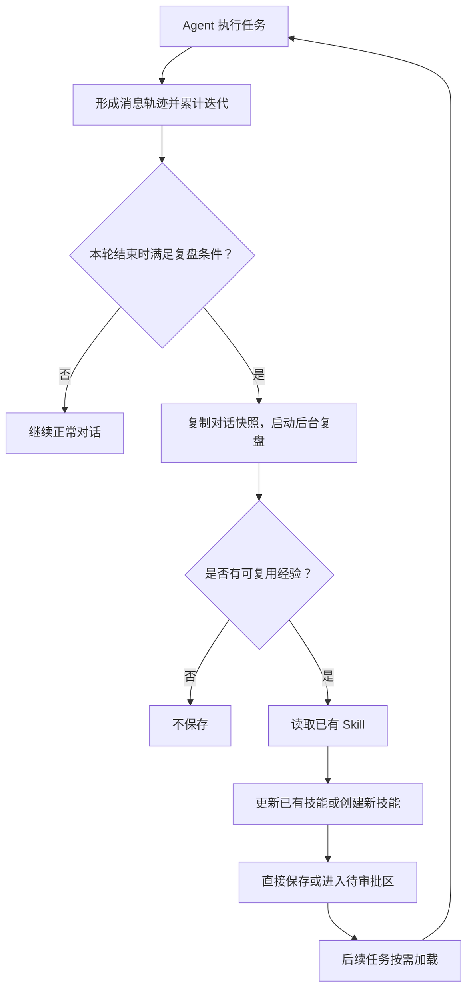

# Pebble 技能（Skill）功能规格

本文说明用户能得到什么，不限定实现；接口字段与语义见 `contracts/skill.md`，与记忆、资料库的分工见第 10 节。

## 1. 目标

Pebble 在长期使用中积累“某类任务该怎么做”的经验：被用户纠正过的错误、反复尝试后有效的做法、摸索出的固定流程，整理成可读、可修改的操作说明，下次遇到同类任务时按需取用。学习只发生在文件与上下文层面，不改动模型本身。

## 2. 四类信息

| 类别 | 回答的问题 | 示例 |
| --- | --- | --- |
| 历史记录 | 之前发生了什么？ | 调了哪个工具、返回什么错误、用户如何纠正 |
| 长期记忆 | 有哪些事实每次都要知道？ | 用户偏好、账号与联系人事实、表达习惯 |
| 技能 | 下次这类任务该怎么做？ | 排障步骤、输出格式、操作顺序、验证方法 |
| 资料库 | 具体资料的内容是什么？ | 文档正文、笔记、项目细节 |

记忆放不下做法，资料库放不下流程；四者各管一件事。某类任务的具体做法不写入长期记忆（`memory-spec.md` §3.1 已有此约定），技能里也不复制资料正文，需要时去资料库取。历史记录的具体形态是执行轨迹（第 5 节）；历史对话检索的约定在 `memory-spec.md` §4，本规格只约定轨迹对技能学习提供什么。

## 3. 技能的形态

- 一个技能一个目录，入口是 `SKILL.md`：frontmatter 保存名称、描述等元数据，正文写适用场景、操作步骤、注意事项和验证方法。
- 目录可附带参考资料（`references/`）与模板（`templates/`），正文需要时再读取，不随技能一起进入上下文。
- 目录名是技能的稳定标识，创建后不变；显示名可以改。
- 技能是说明书，不是程序：被读取不等于执行了动作，Agent 读完仍通过既有工具完成操作。不引入随技能分发、可自动运行的脚本。
- 技能不授予任何额外权限：外部操作（发邮件、建日程）仍走既有的确认与轮次限制，技能内容不能绕过它们。
- 技能保存在实例数据目录，由独立的本地 Git 仓库管理：每次修改留有历史、可回滚，不推送到远端。

## 4. 加载：目录常驻，正文按需

- 每轮只注入容量受限的技能目录（名称加一句描述），不注入正文。
- 模型判断与当前任务相关时读取正文；正文指向的参考资料与模板再按需读取；没有相关技能时一个都不加载，也不影响任务。
- 用户可以在发起任务时明确指定要用或不用哪些技能；未指定时由模型按目录判断。
- 技能内容与用户本轮要求冲突时，以用户要求为准；技能之间冲突时向用户追问。
- 加载记录（实际读取了哪些技能、哪个版本）对用户可见。加载只证明内容交给了模型，不证明流程被遵循或操作成功。

## 5. 执行轨迹

- 每个任务的执行自动形成按顺序的轨迹：用户消息、Agent 回答、每一次工具调用及其返回，含每次调用的成败状态。形成即随任务持久保存，重启不丢失，无需用户开启。
- 轨迹回答“之前发生了什么”：尝试了什么、哪一步失败、用户如何纠正、后来怎么成功。它是技能学习的证据来源——明确学习整理的“刚才的过程”（第 6 节）与后台复盘读取的执行记录（第 7 节）都以它为准，不依赖模型的复述或另行导出的文件。
- 轨迹记下一个任务“完成”，只代表该次执行结束，不代表其中的方法经过独立验证；哪些经验值得沉淀由复盘判断（第 7 节）。
- 沉淀进技能的是做法，不是轨迹本身：技能正文不复制消息原文、具体参数值等一次性内容。轨迹留在本地实例，不进入技能的 Git 仓库，也不随技能分享。
- 轨迹导出为外部格式（调试、训练数据）不在本规格范围内。

## 6. 创建与修改：三个来源

| 来源 | 方式 | 生效 |
| --- | --- | --- |
| 人工编写 | 用户在管理页直接创建或编辑 | 保存即生效 |
| 明确学习 | 用户说“把刚才的排查过程记成技能”，Agent 把当前对话或指定资料整理成技能 | 用户要求即保存 |
| 自动沉淀 | 后台复盘从近期执行轨迹中提炼（第 7 节） | 见下 |

- **用户创建的技能受保护**：自动复盘不能直接改写，只能生成待确认的修改建议，用户看过差异后决定。用户自己随时可改。
- **Agent 沉淀的技能**：复盘可以直接更新，改动出现在管理页的修改历史里，出错靠 Git 历史回滚。
- 修改既有技能前必须重新读取当前文件，不允许基于过期内容覆盖。

## 7. 自动沉淀：后台复盘

### 7.1 触发与运行

- 自上次写入技能以来，累计完成 10 个用户消息轮后触发一次（数值可配置，可整体关闭）；写入后重新计数。
- 复盘由独立的后台会话执行，直接读取自上次以来的执行轨迹（第 5 节），不要求先导出任何轨迹文件。
- 不占对话轮、不进任务时间线，用户消息不等它；失败只记服务端日志，不影响主回答。
- 与记忆的后台回顾各自独立运行，互不合并、互不影响。

### 7.2 复盘找什么

- 用户对步骤、方法、格式作出的纠正；
- 经过多次尝试才找到的有效做法；
- 既有技能中错误、过时或缺失的内容。

### 7.3 处理优先级

优先补正在使用的技能，其次修正其他既有技能，再次补充参考资料，最后才创建新技能。新技能应覆盖一类任务，不为一次会话生成一个狭窄的新条目。

### 7.4 不沉淀什么

- 暂时性故障（“那个接口当时报错”）；
- 尚未解决的失败；
- 一次性任务的完整经过。

没有可靠经验就不保存，复盘允许空手而归。

## 8. 长期维护

- 记录每个技能的查看与使用情况。
- 长期不用的技能先标记为陈旧并提示用户，进一步可移入归档；归档可恢复，恢复后照常加载。
- 重叠技能的自动合并默认关闭，不做。
- 所有修改（含自动沉淀）在管理页可见，并可通过 Git 历史回滚。

## 9. 界面

管理页用于浏览目录、查看正文与附件、创建、编辑、启停、归档与恢复、查看使用情况和修改历史；待确认的修改建议在同一处审阅。发起任务时可以在输入框选择或排除技能。

## 10. 与记忆、资料库的分工

- 只问一个问题：**Agent 下次遇到这类任务，照着它做才不会错**的放技能；“这一轮没看到就会答错”的事实放记忆（判据见 `memory-spec.md` §2.2）；被问到才需要的资料正文放资料库。
- 一件事两边都沾的拆开放：影响做法的规则进技能，背景事实进记忆，细节资料进资料库。
- 技能沉淀的提示与记忆提示各自独立，不复用。

## 11. 分阶段

1. **基础**：形态、目录与按需加载、手工创建、明确学习。明确学习只依赖当前对话本身，不依赖额外的轨迹基础设施。
2. **轨迹**：完整、持久的执行轨迹（第 5 节），跨任务可查。
3. **自动沉淀**：复盘触发、经验提炼、按来源写入或提建议；建立在轨迹之上。
4. **维护**：使用统计、陈旧标记、归档恢复、修改审计。

## 12. 验收

本文每条规则都是验收项。此外必须用真实模型走通以下场景；只测文件读写或使用固定模拟回答不算通过。

1. **手工技能生效**：写一个“周报整理”技能（先查日历本周事件、按固定分节、结尾列下周安排）→ 新会话说“整理本周周报” → Agent 读取正文并按步骤执行；说“查一下明天的日程”时不加载它。
2. **明确学习**：一次排查投屏失败的过程反复尝试后成功，用户说“把这个排查过程记成技能” → 保存的正文包含失败原因与排查顺序，不含当时的一次性细节。
3. **自动沉淀**：任务中 Agent 输出格式被用户纠正并重做 → 阈值后复盘沉淀该纠正为做法；同一次任务里的临时接口报错没有变成“以后不要用”的规则。
4. **更新优先于新建**：既有技能缺一步导致这次绕了路 → 复盘补上该步骤并保留其余内容，没有新建重复技能。
5. **受保护技能**：复盘想修改用户手写的技能 → 只出现待确认建议，正文未被改动；用户确认后生效且留有历史。
6. **维护与回滚**：长期不用的技能被标记并归档，恢复后可再次加载；一次不当的自动修改可以从历史回滚。
7. **轨迹证据**：复盘沉淀的做法能对照执行轨迹中真实发生的调用与纠正（含失败的尝试），不是模型的凭空总结；沉淀的正文不含消息原文与具体参数值；服务重启后轨迹仍在，复盘照常进行。

## 13. 参考与取舍

沿用 [Hermes Agent](https://hermes-agent.nousresearch.com/docs/user-guide/features/skills/) 的核心设计：目录 + `SKILL.md` + 附件的形态、目录常驻与正文按需的渐进式加载、轨迹/记忆/技能的信息三分、持久化轨迹作为复盘证据与“完成不等于验证”的区分、三个创建来源、后台复盘的沉淀标准与“改旧优先于建新”的顺序、使用统计与归档回滚、受保护技能的概念。不同之处：

- 复盘按用户消息轮计量并跨任务累计，而不是按 Agent 内部循环迭代计数——用户可预期，且与记忆回顾同一类节奏。
- 轨迹是任务执行记录的完整持久化，复盘直接读取，不依赖轨迹导出；ShareGPT 等外部导出格式不在本规格范围内。
- Hermes 的技能写入默认直接生效、审批是默认关闭的全局开关；这里改为按来源区分——用户技能一律经确认，Agent 技能直写、靠历史回滚兜底。
- 不引入可执行脚本附件（Pebble 的工具面没有脚本执行通道）、Skills Hub 安装与跨实例分享、默认关闭的自动合并。

