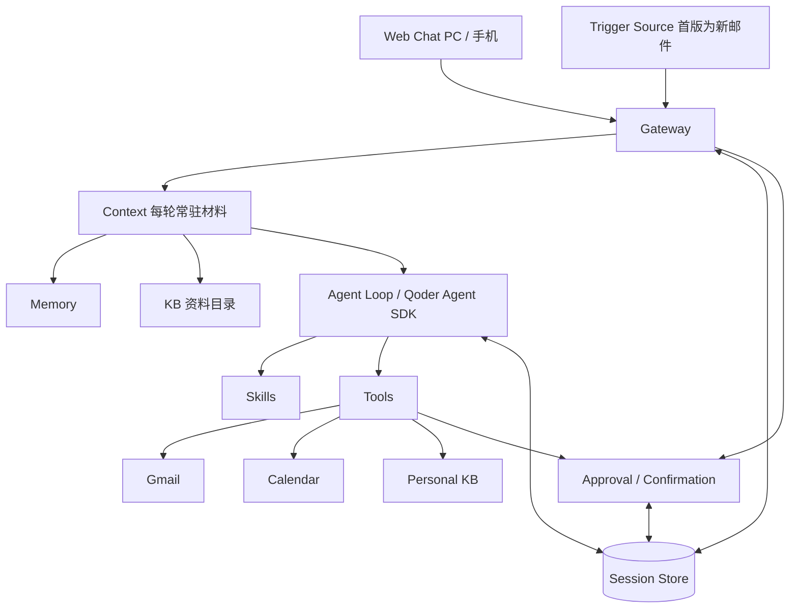

# Pebble v1 设计

本文承接 `v1-spec.md`：规格定义做什么和验收标准，本文定义组件划分、执行约束的实现方式、代码结构、交付顺序与验证证据。两者冲突时以规格为准。

各域的接口字段与语义单独成文，位于 `docs/contracts/`：`mail.md`、`calendar.md`、`personal-kb.md`、`skills.md`。记忆与个人资料库的产品行为分别见 `memory-spec.md` 与 `kb-spec.md`。本文不重复契约字段。实现状态与已知偏差统一记在 `status.md`。

第 1–6 节是设计，改动需要说明理由；第 7 节定义交付阶段；第 8–9 节是工作约定；第 10 节记录实现要点。

## 1. 整体结构

采用 Python、Qoder Agent SDK、SQLite 和支持 PC、手机浏览器的响应式 Web。Python 服务常驻运行，由 SDK 管理本机 qodercli 子进程；整体部署为单实例，通过 HTTPS 暴露给已认证的单用户远程访问。

对话是默认入口，触发源是第二个入口，两者汇入同一 Gateway，走同一套调用调度、时间线与确认流程。模型自主组合工具完成目标，程序保证外部写授权、持久化与去重约束。



个人上下文沿用四层边界（参考 OpenHuman 的划分，取舍见第 5 节）：

- **Memory 与个人知识库**保存、整理和检索信息，不执行外部操作，也不决定下一步做什么。
- **Context** 每轮装配常驻材料：长期记忆全文与资料目录（资料的指针），各有容量上限；历史对话、资料正文、邮件与日程不自动注入。
- **Agent Loop** 由 SDK 承担推理、规划与工具调用。
- **Tools** 访问外部服务与本地资料；外部写入统一由 Confirmation 执行。

图中 Tools 下方表示工具实现；外部写入统一由 Confirmation 执行，授权来源见第 4 节。Idempotency 由工具执行与存储中的唯一约束和状态检查共同实现。

参考 Hermes 的入口、Agent、工具和会话存储划分。Qoder Agent SDK 承担 Agent 循环与会话接入，Pebble 实现产品交互及执行约束。[Hermes 架构](https://hermes-agent.nousresearch.com/docs/developer-guide/architecture/)、[Qoder Agent SDK](https://docs.qoder.com/cli/sdk/overview)。

## 2. 组件与代码结构

| 组件 | 职责 | 位置 |
| --- | --- | --- |
| Web Chat | PC 与手机共用响应式界面，以统一 Composer 选择新任务模型、上传附件，并在有序时间线展示对话、附件和完整草稿卡 | `web/`（TypeScript + React + Vite） |
| Gateway | HTTP、SSE、认证与远程访问入口；接收用户与触发源输入，定位会话，启动 Agent 并返回结果 | `server/api/`（HTTP/SSE/认证）、`server/gateway/`（后台运行） |
| Context | 每轮装配基础提示与常驻材料（`USER.md`、`MEMORY.md`、资料目录），控制各块容量；不预先检索资料或历史 | `server/agent/context.py`、`server/agent/client.py` |
| Agent Loop | 通过 Qoder Agent SDK 调用模型和工具，加载已生效 Skills，按目标决定下一步 | `server/agent/` |
| Memory | 保存用户背景、偏好、长期目标与约定，每轮判断与后台回顾负责写入；不记录出处 | `server/memory/` |
| Skills | 保存可复用流程，管理两条来源、草稿、审核、生效版本及 Git 历史 | `server/skills/` |
| Tools | 集中注册、校验和调用工具；每个实现负责自己的认证、协议和业务校验 | `server/tools/` |
| Session Store | 保存会话关联、任务目标与固定模型、运行状态、网页时间线、附件关联、待确认内容及版本、确认记录和逐项执行结果 | `server/sessions/`、`server/attachments.py`、`server/approval/` |
| Trigger Source | 触发源插孔与实现；首版为 Gmail 增量检测，把未处理邮件交给 Gateway | `server/gateway/runtime.py`（插孔）、`server/tools/gmail/sync.py`（实现） |

PC 与手机共用 `web/` 中的页面组件和交互逻辑，按屏幕尺寸调整布局；两端提供规格要求的完整功能，使用同一套 API、任务状态和确认流程。手机不要求与服务在同一局域网，远程访问的传输与安全要求见第 6 节。

Session Store 是 Gateway、Agent Loop 与 Confirmation 的共享持久化入口。业务状态与网页可见时间线使用 SQLite；资料原件、规则和 Skill 使用文件保存。SDK 会话只负责模型上下文恢复，不作为网页展示数据源。

代码结构：`#` 后是该条目的职责，目录注释对应上表组件。

```text
Pebble/
├── web/                      # Web Chat：TypeScript + React + Vite
├── server/                   # Gateway + Agent Loop + Tools + Session Store
│   ├── main.py               # 服务启动、SDK 配置与工具注册
│   ├── config.py             # 模型、持久目录与外部服务凭证引用
│   ├── db.py                 # SQLite 连接、约束与迁移
│   ├── attachments.py        # 上传校验、任务隔离存储与时间线附件关联
│   ├── errors.py             # 跨模块共享的业务异常
│   ├── pyproject.toml
│   ├── api/                  # HTTP/SSE 传输层
│   │   ├── routes.py         # 请求结构、服务依赖与路由：健康检查、任务、对话、确认
│   │   ├── auth.py           # 单用户认证、令牌校验与请求来源检查
│   │   └── errors.py         # 业务异常到 HTTP 响应的映射
│   ├── gateway/              # 应用后台运行，不依赖 HTTP 请求生命周期
│   │   ├── runtime.py        # 输入登记、调用调度、事件订阅、恢复、结果交回与触发源插孔
│   │   └── agent_contract.py # Agent 调用接口与事件类型
│   ├── agent/                # 不实现自有循环，只装配 SDK
│   │   ├── client.py         # SDK 客户端装配、消息流转与会话恢复
│   │   ├── models.py         # 当前 Qoder 账号模型目录及创建/运行时校验
│   │   ├── mcp.py            # 应用进程内的工具端点：按轮次登记模型可见工具
│   │   ├── toolset.py        # 按装配依赖绑定业务工具，按轮次筛选模型可见范围
│   │   ├── context.py        # 每轮系统提示、常驻材料（记忆、资料目录）与技能名单组装
│   │   └── prompt.py         # 面向个人助理的系统提示
│   ├── storage/              # 实例数据目录的共享基础设施
│   │   ├── datarepo.py       # 数据目录的进程内锁（memory 与 personal_kb 共用）与 Git 仓库 .gitignore
│   │   └── line_edit.py      # 按行锚点编辑：带锚点视图与整行修改（memory 与 personal_kb 共用）
│   ├── tools/                # 统一注册 + 按服务分目录实现
│   │   ├── registry.py       # 工具定义、副作用声明与统一注册
│   │   ├── gmail/
│   │   │   ├── tools.py      # 给模型的查询与草稿工具
│   │   │   ├── service.py    # 邮件草稿的业务校验、存储与版本管理
│   │   │   ├── sender.py     # 确认后发送与结果核实，只由 Confirmation 调用
│   │   │   ├── client.py     # Gmail 协议与认证
│   │   │   ├── sync.py       # Gmail 增量检测与游标
│   │   │   └── trigger.py    # 新邮件触发轮的消息与材料
│   │   ├── calendar/
│   │   │   ├── tools.py      # 查询、冲突检查、直连创建
│   │   │   ├── service.py    # 日程字段校验与不可变内容版本
│   │   │   └── client.py     # iCloud 协议与认证
│   │   └── personal_kb/
│   │       ├── tools.py      # 列举、保存、读取、更新、历史版本、检索
│   │       ├── service.py    # 文件与目录组织、Git 提交、引用生成、索引同步与按引用读取
│   │       ├── index.py      # 分节切分、FTS5 索引与增量替换、重建与检索排序
│   │       ├── catalog.py    # 每轮常驻的资料目录：按目录分组、最近更新优先、受字符上限约束
│   │       └── topics.py     # 后台主题整理（Phase 5）
│   ├── sessions/             # Session Store
│   │   ├── service.py        # 会话关联、运行状态、待确认内容与逐项结果
│   │   ├── repository.py     # 任务与操作 SQL
│   │   ├── runs.py           # 后台调用记录 SQL
│   │   ├── timeline.py       # 有序文字、草稿卡、提示与错误项的物化读取
│   │   └── history.py        # 历史对话检索：FTS5 派生索引、检索前增量同步、前后文读取
│   ├── approval/             # Confirmation
│   │   ├── service.py        # 授权后的执行：版本校验、取得执行权、发送或创建与结果保存
│   │   └── repository.py     # 确认记录与执行结果 SQL
│   ├── memory/               # Memory
│   │   ├── service.py        # 两份记忆文档的读写、按行锚点编辑（查重）与容量检查
│   │   ├── judge.py          # 每轮专用记忆判断：提示词与输入组装
│   │   ├── notices.py        # 记忆材料（带容量）与按真实工具结果生成的提示
│   │   └── review.py         # 后台记忆回顾：登记、执行与重启恢复
│   └── skills/               # Skills
│       ├── service.py        # 两条来源、草稿、审核与版本管理（文件 + Git）
│       └── loader.py         # 向 SDK 同步生效 Skill 名单
├── tests/                    # 共享 fixture 位于根目录
│   ├── api/                  # 健康检查、真实 HTTP/SSE 与进程重启
│   ├── agent/                # 模型目录与校验
│   ├── gateway/              # 后台调用、SDK 选项装配与事件映射、工具端点与轮次边界、结果回传
│   ├── storage/              # 真实 SQLite 与数据目录：草稿、确认执行、记忆、资料库与历史检索
│   ├── tools/                # 工具契约、校验、协议内容与发送结果
│   ├── support/              # Agent 替身和可启动测试后端
│   └── acceptance/           # 真实模型验收脚本，不随 pytest 运行
└── docs/
    ├── v1-spec.md
    ├── v1-design.md
    └── contracts/            # 按域的接口字段与语义
```

这是起始结构，按实际代码规模合并或拆分文件。目录按职责组织，文件数量以职责边界为准，不为凑数增加转发层。HTTP 路由集中在 `api/routes.py`；后台调用与事件订阅归属 `gateway/`，使触发源入口无需依赖 HTTP 模块。Idempotency 不设独立子系统，由 `approval/`、`sessions/` 和具体工具的唯一约束与状态检查共同实现；数据目录的进程内共享锁与 Git 仓库 `.gitignore` 收敛在 `storage/datarepo.py`，各域（`skills/`、`personal_kb/`）保留自己的 git 提交与原子写小函数；`memory/` 不做版本管理，只保留原子写。

直接接入 Qoder Agent SDK 带来的取舍：

- Agent 循环和模型上下文历史由 SDK 与 qodercli 承担；`agent/` 只做客户端装配、上下文和系统提示，不实现自有 loop/runtime。
- 模型历史复用 Qoder CLI 的本地会话存储；SQLite 另行保存前端唯一读取的应用时间线，以及任务、运行、草稿、确认和执行状态。两份数据职责不同，不相互解析或回填。
- Memory、Skill 与资料内容放在实例数据目录而非代码包内，不内置业务流程。
- 外部写工具的执行函数统一由 `approval/service.py` 调用；邮件发送不注册给模型，日程创建按轮次注册，详见第 3 节。

恢复会话时明确指定 `resume`。[会话管理](https://docs.qoder.com/cli/sdk/session-control)

## 3. 工具接入

Gmail、Calendar、Personal KB、Memory 与 Skills 都通过相同入口注册，没有专属于某种服务的核心调度分支。

每个工具提供名称、能力说明、参数结构、调用实现及副作用类型。副作用由程序声明，区分只读、本地写入、按轮次暴露的外部写入和永不暴露的外部写入，不能由模型更改。

- 只读工具校验参数后直接调用。
- 本地写工具遵守自身规则，例如只允许生成 Skill 草稿，不能代替用户批准 Skill；只允许写知识库文件，不产生外部副作用。
- 直接外部写工具由模型在用户亲自发起的轮次调用，自己完成保存内容、取得执行权、调用外部服务与保存结果。日程创建属于这一类，边界见 `contracts/calendar.md`。
- 永不暴露的外部写工具只向模型注册准备草稿和读取已确认内容的方法，原始写入方法不注册给模型；执行函数由 Confirmation 在用户确认最终版本后调用。邮件发送属于这一类。

首版使用 Python 函数和静态注册，由应用进程自己的 MCP 端点按轮次暴露：每轮登记一个一次性路径，模型只看到当轮允许的工具，不另建常驻 MCP 服务。注册表按用途隔离为三个：前台对话工具（默认注册表）、后台记忆回顾专用的 `review_registry`（`memory_edit`）、每轮记忆判断专用的 `judge_registry`（另加 `memory_ask`）；后两个只在各自的一次性会话中出现。[工具接入](https://docs.qoder.com/cli/sdk/tools)

### 轮次可见范围

模型每轮可见的工具由注册时声明的副作用与轮次类型共同决定。这是全部域共用的唯一规则（代码为 `agent/toolset.py` 的 `ALLOWED_EFFECTS`），各域契约只声明自己工具的副作用，不再重复本表：

| 副作用 | 例子 | 新邮件触发轮 | 用户对话轮 | 执行结果回传轮 |
| --- | --- | --- | --- | --- |
| `READONLY` | 查询、检索、读取 | ✓ | ✓ | ✓ |
| `LOCAL_WRITE_ALL_TURNS` | 资料新建与修改 | ✓ | ✓ | ✓ |
| `LOCAL_WRITE` | 邮件草稿、资料归档、Skill 草稿 | — | ✓ | ✓ |
| `LOCAL_WRITE_USER_TURN` | 资料删除、移动、恢复 | — | ✓ | — |
| `DIRECT_EXTERNAL_WRITE` | 日程创建 | — | ✓ | — |
| `EXTERNAL_WRITE` | 邮件发送 | — | — | — |

SDK 内置工具同样只在用户对话轮开放：联网查询（`WebSearch`、`WebFetch`），以及任务有附件时读取附件的 `Read`。

触发轮与结果回传轮的输入来自系统而非用户亲自开口，因此两者都拿不到外部写与联网查询，邮件、资料或 Skill 内容中的指令无法据此驱动外部写入或让数据离开实例。纯触发轮也不会在用户未参与时产生待确认内容、沉淀 Skill 草稿或删除资料；它能做的本地写只是保存或更新资料，结果有提示、有版本、可恢复。定向修改某张草稿的轮次另外绑定目标 `operation_id`，禁止新建操作，也不能读写其他草稿。

### 错误词汇

业务错误统一定义在 `server/errors.py`，HTTP 响应体与交回模型的工具错误共用同一套名称与字段（HTTP 映射在 `server/api/errors.py`）。各域通用的错误：

| 名称 | HTTP | 附加字段 | 含义 |
| --- | --- | --- | --- |
| `not_found` | 404 | — | 对象不存在；不属于当前任务的对象同样按不存在处理 |
| `version_conflict` | 409 | `current_version` | 基于的版本已不是当前版本，不写入 |
| `not_editable` | 409 | `status` | 当前状态不允许修改 |
| `unavailable` | 503 | — | 所需依赖未装配或不可用 |

校验失败统一为 422，附 `errors[]`（每项 `field`、`message`），不保存数据；存储或索引不可用统一为 503。各域的具体名称（`invalid_draft`、`invalid_kb`、`invalid_memory`、`memory_full` 等）见对应契约。任务与对话接口另有 `task_active`、`task_id_conflict`、`retry_unavailable`、`session_conflict`（409）与 `invalid_model`、`invalid_attachment`、`invalid_history`（422）。调用不在当轮清单里的工具按不存在处理，不解释原因。

### 待确认内容与新增工具

待确认内容展示完整关键内容、目标和实际影响，提供必要的编辑字段。编辑后由工具重新校验、保存新版本。服务认证、邮件线程、日历冲突、资料引用等逻辑留在具体工具中。

新增工具只需增加实现并注册，按需要补充编辑界面和触发代码，沿用现有 Agent 与确认流程；同时补一份 `docs/contracts/` 下的域契约。

首批工具的职责：

| 工具 | 首版能力与关键约束 | 契约 |
| --- | --- | --- |
| Gmail | 搜索邮件，读取单封、完整往来及入站附件，准备回复或主动新邮件，确认后发送并核实结果；外发只支持纯文字，草稿保存在本地 | `contracts/mail.md` |
| Calendar | 查询 iCloud 日程、检查冲突；用户本轮信息齐全且无冲突时直接创建，冲突时不创建、把撞车日程交回模型转述，用户明确要求照建时带覆盖参数创建；正确处理时区和已有重复/全天日程 | `contracts/calendar.md` |
| Personal KB | 保存、索引、检索、更新、删除与恢复 Markdown 资料，维护主题页，归档任务关键信息与结果；内部引用带文件路径、原文位置和内容版本，只用于读取原文，不作为出处 | `contracts/personal-kb.md` |
| Memory / Skills | 规则与流程的文件存取、两条沉淀来源、草稿审核与生效名单加载 | `contracts/skills.md` |

## 4. 运行机制

### Session Store

任务开始、等待用户、准备操作和取得执行结果时保存必要状态。每个任务在创建时保存所选模型，之后每个主回答、恢复轮、记忆判断与回顾均读取这一字段；标题生成、资料说明与图片说明生成使用独立的轻量模型（见 §6 模型与 SDK 约束）。每个 Agent run 产生有序时间线项：连续文字增量合并为一个文字项；草稿工具成功时结束当前文字项并在当前位置插入一张卡；后续文字建立新项。页面刷新后读取已保存时间线；SSE 只传输实时变化，断开不取消后台执行，运行结束后前端重新读取时间线对账。

用户消息的文字可为空，但文字和附件不能同时为空。上传先整批完成签名、UTF-8、类型、数量和大小校验，任一失败则整条消息不登记。附件以内部 ID 加白名单内的小写扩展名落在 `data_dir/agent/workspaces/{task_id}/attachments/`（Runtime 的 `Read` 按扩展名识别 PDF 与图片），原文件名只作为元数据；SQLite 保存任务归属与时间线顺序。图片同时转成 SDK 结构化 Base64 图片块，普通文件由该任务工作目录中的 `Read` 读取；只有存在附件的用户轮开放 `Read`，权限回调把路径限制在当前任务 workspace。附件材料明确标为不可信输入，不改变外部写授权。删除任务时先清理附件记录，再删除整个任务 workspace。

时间线只保存草稿卡位置和 `operation_id`，读取时物化该操作的最新版本和执行状态。同一草稿的直接编辑和 Agent 修改都只新增不可变版本，不移动卡片，也不新增第二张卡。卡片定向消息把目标操作的最新完整内容作为本轮材料，同时工具端点禁止新建操作或读写其他草稿。

每个任务关联自己的会话。同一会话的 Agent 调用串行进行，避免上下文互相覆盖。Agent 一轮结束不等于任务成功，界面依据实际工具结果展示各项进度。

不需要工具的对话轮次同样走这条路径：登记输入、启动一轮、把文字写入时间线，只是不产生操作项。

### Approval / Confirmation

所有具有副作用的外部写操作都经同一套执行机制：保存不可变内容、写确认记录、原子取得执行权、在事务外调用外部服务、保存结果。区别只在授权来自哪里。

邮件发送的授权来自用户在卡片上对最终版本的明确确认；日程创建的授权来自用户本轮的明确要求与齐全信息，冲突时不创建、不留记录。产品规则见 `v1-spec.md` §3.3，日程冲突与覆盖参数的字段语义见 `contracts/calendar.md` §2。

确认记录绑定操作标识和最终内容版本。用户确认路径的身份来自已登录用户；执行直接读取已确认内容，不让模型重新生成参数。修改使旧确认失效；已经执行中的内容不能原地修改。

程序通过数据库原子状态更新取得执行权，随后在事务外调用工具。重复确认返回已有状态，不能重复调用；直接创建同样只在取得执行权后调用一次外部服务。确认和执行不依赖浏览器连接保持打开。SDK 工具权限不代替业务授权；等待用户时返回已保存的待确认状态，不让权限回调一直等待浏览器端响应。

一次执行按以下顺序处理，邮件与日程共用：

1. 写事务内检查任务与操作存在、确认版本等于当前版本；已有执行记录时直接返回已有状态，不再次执行。
2. 首次执行要求操作处于 `pending`：同一事务写入确认记录并将状态置为执行中，随后返回已接受状态。
3. 在写事务内标记执行开始并读取确认版本；提交后调用该域的执行函数。用户确认路径由后台任务执行，直接创建路径在工具调用内同步执行。执行字段全部来自该不可变版本，重复调度不能再次取得执行权，确认输入不含正文。
4. 新事务保存实际结果并更新状态：明确成功记成功与外部标识；明确失败记失败与原因；超时、异常或返回不符契约记待核实，不推断未执行，不自动重试。
5. 结果保存失败时向调用方报错，已有执行记录仍阻止重复执行；进程中断遗留的执行中状态在服务启动时恢复为待核实或明确失败（按是否已进入执行阶段区分），该恢复不放进 `init_db`，避免普通初始化影响正在执行的调用。

结果保存后是否登记回传轮取决于授权路径：用户确认后执行的结果作为输入交回对应 Agent 会话；直接创建的结果已经就地返回给模型，不再登记回传，避免同一件事汇报两遍。核实把待核实升级为成功时始终登记回传。

回传任务取首次成功确认的任务，不读取操作创建任务，也不改动各任务的会话关联。首版按单实例实现，不增加多实例执行接管、通用重试，也不开放任意修改操作状态的接口。

日程创建与邮件发送分别记录结果。发现相关内容已变化、字段不明确或时间冲突时重新澄清：邮件准备新草稿等用户确认，日程在对话中追问或说明冲突；不自动修改已确认内容。各域的状态词汇与核实规则见对应契约。

### Trigger Source

触发源在已授权范围内主动启动处理，与用户对话共用同一调度入口。接口只有启动、停止与错误状态三项，检测逻辑留在各域实现中，通用层不持有域措辞。

首版触发源是 Gmail 增量检测：按固定间隔查询历史增量，只接受收件箱新增邮件，游标在成功交给 Gateway 的持久化任务入口后推进，重复通知由 Gateway 按邮件标识去重。游标失效明确停止检测并在健康检查中显示原因，不静默跳过缺口。

新增触发源（如日程提醒、定时任务）只需在该域实现同一接口、提供触发轮的消息与材料，并在调度入口增加一个分支；不建注册表，不往通用层放域文案。

等待用户补充或确认时，保存问题、草稿和状态，结束当前 Agent 运行。用户回应或执行结果到达后继续相应任务；等待中的任务不阻塞其他任务。

首版用常驻进程内的定时与调度代码实现，不引入独立任务系统或任意模型调用的断点恢复。

### 后台记忆回顾与每轮记忆判断

长期记忆有两条发现路径：`memory/judge.py` 的每轮即时判断负责单轮明确表达的事实与偏好；`memory/review.py` 的后台回顾补齐跨轮模式并整理记忆——任务内每完成 5 个用户消息轮（`agent_runs` 中 `kind='message'` 且 `status='done'`，自上次已完成回顾起算），自动登记并执行一次回顾。

判断是一次性 SDK 会话（与标题生成同级的产品能力，非新 TurnKind）：每个用户消息轮认领后与主回答并行启动，临时 MCP 端点只暴露 `judge_registry` 的 `memory_edit`（按行锚点追加、插入、替换、删除与跨分区移动，一次提交的 `operations` 可同时改两个分区、整体生效）与 `memory_ask`，输入是刚发的消息、近期对话（含此前的记忆提示）与带锚点的当前记忆快照（标题附已用与上限字数，放不下时在同一次调用里整理并保存）。分区标准与“写成陈述句”的要求写在 `memory_edit` 的工具说明里，判断与回顾共用。程序按记录到的真实工具调用与结果渲染用户可见提示（实际变更合并为一条"已更新记忆"，另有"内容已存在/想确认/保存失败"，由 `memory/notices.py` 生成），以 `notice` 类型写入时间线（挂在触发它的消息轮上）并经 SSE 推送；模型自述不作为事实来源。判断无状态：不写 `agent_runs`，不占任务运行槽，进程重启即丢弃，失败只记日志、不影响本轮回答。

回顾是一次性 SDK 会话：临时 MCP 端点只暴露 `review_registry` 的 `memory_edit`，输入是窗口内对话文本与带锚点的当前记忆快照；网关按记录到的工具结果返回，有替换、删除或跨分区移动实际生效时渲染一条“已整理记忆”提示，与回顾结束状态同一事务写入时间线（挂在窗口内最后一个调用上），再经 SSE 推送；新增不提示。登记时冻结窗口上下界（`from_rowid`/`through_rowid`），执行期新消息不进窗口。

调度复用 kick 模式：复盘任务在独立的协程表中运行，不占任务运行槽，仅在任务空闲时启动；用户消息永远不等回顾。重启时运行中的回顾标记为 interrupted，计数不推进，下一条消息完成后自动重新触发。手动入口 `POST /api/tasks/{id}/memory-review` 覆盖全任务历史，不受间隔与开关限制。回顾不写 `agent_runs`、不出现在任务列表；与其他写入路径共用同一存储与锁。

### Idempotency

通用层通过操作标识、数据库唯一约束和原子状态检查，防止同一操作重复执行。具体工具负责自身业务身份：例如 Gmail 按邮件 ID 去重，并将同一来信的同一回复关联到已有操作，防止模型重新准备时重复发送。

外部结果分为成功、明确失败和待核实。执行超时或进程中断留下的未决操作不能当作未执行，须先通过对应服务查询实际结果；查不到一次不等于未执行。未核实前不能再次执行，不采用通用自动写重试。

## 5. Memory、Skills 与个人知识库

三者的内容都是实例数据目录内的文件，用户可以直接阅读和修改。Skill 与知识库由一个独立的本地 Git 仓库管理（不是代码仓库），写入即提交，不推送远端，可通过 Git 查看变化和回退。Memory 不做版本管理：内容简短、由模型持续整理，对话里只提示记忆已更新或已整理；数据目录仓库中若仍跟踪 `memory/`，启动时以一次单独提交移出（临时索引构造，不带上其他暂存改动）。格式与字段见 `contracts/skills.md` 与 `contracts/personal-kb.md`。

用户纠正可以由模型或用户主动沉淀为可读、可编辑的 Memory，每轮上下文装配时作为“关于你”“事实与约定”两个固定标题的材料块加载。规则不能覆盖代码中的外部写授权约束：该约束由每轮工具可见范围与 Confirmation 保证，不依赖规则文本或模型自律。

Skill 有两条来源，最终形态相同。用户自建的内容保存即生效，用户就是批准者。Agent 从使用记录（任务时间线、调用轨迹、执行结果、纠正历史）总结出的高频流程先保存为草稿，草稿存放在 SDK 发现目录之外，在对话中提示审阅，展示触发条件、参数、流程、工具、副作用及授权要求。批准绑定最终内容版本；内容再次变化即停止加载，回到草稿等待重新批准。加载器只提供已批准且版本一致的内容，恢复会话时同步当前名单。通过 SDK 的 `skills` 配置限定生效范围。[Skills 接入](https://docs.qoder.com/cli/sdk/skills)

批准某个 Skill 不改变其运行时外部写操作的授权规则：邮件发送仍逐项取得用户明确确认，日程创建仍只在用户本轮明确要求、信息齐全且无冲突时直接执行。Skill 不能声明绕过授权。

个人知识库保存 Markdown 原件与派生索引，以文件为准。索引是数据目录内的派生 SQLite 文件，不进 Git：按二级标题分节后建立 FTS5 全文索引，应用写入在同一把资料库锁内只替换受影响文件的条目，缺失、损坏或与 `kb/` 目录的 Git tree 不一致时整体重建；每次资料库操作前先把用户在文件系统里的改动提交为版本（移动按 `id` 识别并以原内容单独提交，使历史跟随路径），索引按 tree 标识随后对齐。内部引用带文件路径、原文位置与内容版本（commit），只用于读取原文与历史版本；回答依据由模型先检索、再读取原文得到，回答不展示来源，程序不记录回答来源，资料与记忆都不记录出处。

长期状态与知识的组织参考 OpenHuman 的 Memory Tree 与 SuperContext（2026-09-16 查阅），借鉴思路而不照搬实现，完整取舍见 `kb-spec.md` 第 11 节：

- **常驻与按需分开**：每轮只注入小容量的常驻材料——两个记忆文件全文（不查就必须生效的内容）与资料目录（资料的指针，由程序从各资料的标题与 `summary` 现算，上限 1500 字符）——其余按需检索。
- **整理而不堆积**：资料累积后，由 Agent 与后台主题整理维护 `kb/topics/` 下的主题页，代替分层摘要树；主题页是可读、可改、有版本的 Markdown，用户修改优先，可以随时从原始资料重新整理。
- **不采用**：以数据库为准的存储、外部数据全量同步、每个数据块的出处记录，以及每个新会话前的预检索（按实测再决定）。

外部操作有了实际结果后，Agent 自主判断通过 `kb_archive` 归档关键信息及逐项结果，原始内容和模型总结分节写入 `kb/archive/`。资料管理界面经 `/api/kb/*` 直接调用 `KbStore`，与 Agent 工具共用同一套校验、版本与索引规则。

## 6. 远程控制、安全与部署

Gateway 以 HTTP 提交操作、SSE 展示进度。Agent Loop 使用 `qodercn-agent-sdk` 的 `QoderSDKClient` 管理多轮会话并消费消息流；运行时使用 SDK 配套的本机 CLI。[SDK 概览](https://docs.qoder.com/cli/sdk/overview)

### 远程访问

手机访问不要求与服务在同一局域网。设计只固定安全要求，不固定传输方案：

- 对外只暴露 HTTPS；明文 HTTP 不提供服务。
- 单用户认证：未认证请求不能读取任务、时间线、草稿、资料、Memory 与 Skill，也不能提交消息或确认。
- 确认与执行接口校验用户身份与请求来源；身份来自已认证会话，不由请求体声明。
- 令牌与凭证可轮换，失效后立即拒绝；登出使已签发令牌失效。
- SSE 与轮询接口使用同一认证，不为实时通道开免认证旁路。

具体传输（反向隧道、反向代理加域名，或私有网络）在部署阶段选定，选定结果与配置步骤写入 `README.md`。本地开发仍可直接使用回环地址与开发服务器的局域网地址。

### 模型与 SDK 约束

模型目录由 SDK 的 `get_available_models()` 读取（与 Agent 轮次共用 `data_dir/agent/config`），只返回当前账号实际可用的 managed/custom 型号，稳定 ID 取条目的 `value`：托管型号如 `qmodel_38max`，自定义型号为 UUID。CLI `--list-models` 只打印显示名，无法还原调用值，不使用。目录读取区分两类结果：读不到目录是暂时的，读到目录而型号不在其中才是确定的不可用。最近一次成功读到的目录连同读取时间落盘在 `data_dir/agent/models.json`，服务启动时后台预读；读取失败先重试，仍失败不覆盖缓存，并发读取共享同一次子进程。`GET /api/models` 有缓存即立即返回（超过 5 分钟或上次刷新失败时后台刷新），以 `stale` 标记最近一次刷新失败，从未读到过才同步读取。新建任务不等目录读取：24 小时内的缓存里有该型号即通过，缓存超过 60 秒就在后台刷新；型号若其实已下线，由首轮校验读到最新目录后让该轮明确失败。缓存里没有该型号或没有可用缓存时才同步读取，读不到且无可用缓存时返回服务不可用。已有任务每轮校验固定型号（复用 60 秒内的目录），读不到且无可用缓存时放行，由模型调用本身给出结果；型号确定不在目录中时本轮明确失败，不改用其他模型。前端在本机保存上次目录，先显示再刷新，读取失败时沿用旧目录并提供重试。自动邮件任务显式保存服务端默认模型。目录只含托管与账号自定义型号，主对话、恢复轮与记忆调用不走自有 API Key。任务标题、资料说明与图片说明这类一次性生成使用轻量模型：配置 `PEBBLE_LIGHT_MODEL_*` 时通过 `resolve_model` 返回 `CustomModel`（当前取 `deepseek` / `deepseek-flash-pg`），不配时沿用 `PEBBLE_QODER_MODEL`。轻量模型三项（供应商、密钥、型号）在装配期校验完整性，缺项直接报错，不静默退回托管模型；供应商标识经 `agent/client.py` 的登记表校验，未登记同样报错并在报错中列出可登记项，登记表的增补以 `list_byok_providers()` 目录为准，协议风格统一取 `openai`。不增加动态路由模块。[Python SDK 参考](https://docs.qoder.com/cli/sdk/references-python)

SDK 显式限定项目工具和必要的 Skill 能力，使用独立工作目录与配置目录，限制配置加载来源，禁用可绕过外部写授权或 Skill 审核的通用 Shell、任意文件写入及无关扩展；使用面向个人助理的系统提示。工具授权不使用权限绕过模式。[权限控制](https://docs.qoder.com/cli/sdk/permissions)

### 凭证与数据

模型与外部服务凭证仅保存在服务端，不进入聊天上下文、前端或 Git。外部内容（邮件、资料、Skill 文本）中出现的指令只作为材料，不能代替用户授权。

实例数据目录保存 SQLite、SDK 会话与每任务独立工作目录（含上传附件）、Gmail 同步游标与凭证、`kb/`、`kb-index.sqlite3`、`memory/`、`skills/` 与 `skill_drafts/`。日志关联会话和操作，保留实际结果，避免记录凭证。

## 7. 交付阶段

按 `v1-spec.md` 第 5 节的两个验收场景逐步交付完整链路。各阶段当前进度见 `status.md`。

| 阶段 | 交付物 | 通过条件 |
| --- | --- | --- |
| 1. 验证依赖 | Qoder Python SDK 与配套 CLI、Gmail、iCloud、资料解析的最小验证程序 | 目标模型可调用自定义工具、会话按 ID 恢复；工具与 Skill 加载边界有效；真实接口可用；资料能定位原文；SDK 与 qodercli 版本锁定 |
| 2. 对话与邮件完整链 | Web → Gateway → Agent → Gmail → 预览编辑 → 确认发送 → 结果 | 纯对话轮次可用且不触发工具；PC 与手机均可完成；刷新保留草稿与时间线顺序；旧确认、重复确认及重复准备不能重复发送 |
| 3. 跨工具任务 | Memory、Calendar、Personal KB 接入 | 规格两个场景都能组合工具、追问、按第 4 节取得授权、准确报告部分结果；归档关键信息与结果，原始内容与总结分开 |
| 4. 触发源与后台运行 | Gmail 增量检测持续运行 | 关闭 Web 仍自动处理新邮件；重复检查不重复处理；等待用户不阻塞其他任务 |
| 5. 能力成长 | Memory 编辑、Skill 两条来源、草稿审核、Skill 的 Git 历史 | 用户自建 Skill 即生效；至少一个 Agent 总结的草稿经审核后生效；未审核草稿不执行；纠正在新会话生效 |
| 6. 远程控制与认证 | HTTPS、单用户认证、来源校验、部署说明 | 手机在外网完成规格两个场景；未认证请求不能读取内容或触发外部写操作 |
| 7. 部署验收 | 常驻服务、配置样例、部署说明和验收记录 | 结合真实 Gmail、iCloud 完成规格中的全部场景，并按第 9 节区分验收结论 |

第一阶段验证 SDK 认证及目标模型配置（托管模型，以及轻量调用的 BYOK）、进程内 MCP 工具、消息流转 SSE、会话持久目录与恢复；确认待审批返回后能结束当前轮，用户确认执行后可将结果交回原会话。同时依据真实材料确定资料格式、检索实现、依赖版本、初次邮件处理起点和远程访问方式。真实写入测试使用明确指定的收件人、日历及内容，取得授权后执行；模拟验证不算真实集成通过。

第三阶段用一个仅用于测试的新工具验证扩展：增加实现并注册后，沿用原有 Agent 与 Confirmation 路径。该测试不增加首版产品功能。

活动邀请与会议安排仅作为验收场景，执行步骤由模型判断，不固化为业务流水线。完整链路为：用户对话或触发源交给 Gateway；Gateway 定位会话，Agent 加载 Memory 和已生效 Skills；Agent 按需调用邮件、日历和 KB 工具，缺信息时保存问题并追问。外部写操作统一由 Confirmation 执行，内容和版本保存到 Session Store：邮件保存草稿等待用户逐项明确确认，关闭页面仍可继续编辑；日程在本轮信息齐全且无冲突时直接创建，冲突时不创建、不留记录，由模型说明冲突并在用户明确要求照建时带覆盖参数重新创建。程序校验版本和执行状态、调用工具并保存逐项结果；Agent 据实回复并归档关键信息及结果，部分失败不报告整体成功。

## 8. 每项工作的闭环

1. 对照规格与相关域契约明确输入、结果及验收条件。
2. 只确定当前实现需要的参数、状态和存储约束。
3. 完成包含必要 Web 交互和持久化的最小链路。
4. 验证实际工具参数、调用次数和保存结果，再检查页面表现。
5. 审查差异、更新必要说明并记录验证证据。

git 提交遵循 `AGENTS.md` 的约定：当前分支、英文 `[Module] Description`、不加 co-authored-by。

## 9. 验证要求

每次变更执行相关检查：Python 后端做静态检查和 pytest，Web 做类型检查、构建和相关测试；修改模型、提示或工具说明时回归相关行为样例。业务约束使用确定性测试，持久化使用真实 SQLite，界面使用 PC 与手机视口端到端测试，外部协议使用真实账号验证。模型行为评测检查工具轨迹、追问及结果准确性，不要求固定措辞或固定调用顺序。验收记录区分已通过、模拟通过和待验证，不能用一次模型成功代替全部验收。

| 检查场景 | 规格依据 | 设计保证 | 验证方式 | 阶段 |
| --- | --- | --- | --- | --- |
| 纯对话轮次不调用工具 | §4.1、§6.1 | 触发轮与对话轮共用调度；不需要工具时无操作项 | 行为评测断言工具轨迹为空且无待确认内容 | 2 |
| PC 与手机布局及完整交互 | §4.6、§6.2 | 响应式页面共用 API、任务状态和确认流程 | 两种视口分别验证任务发起、进度、草稿编辑、确认及资料、规则与 Skill 操作 | 2、3、5、7 |
| 外网手机远程控制 | §4.6、§6.2 | HTTPS + 单用户认证 + 确认校验身份与来源 | 真实外网手机浏览器完成两个场景；未认证请求断言被拒 | 6 |
| 页面关闭、刷新、等待用户 | §3.2、§6.1 | 待确认内容持久保存，等待时结束当前 Agent 运行，SSE 断开不取消执行 | 真实 SQLite + PC 与手机视口端到端 | 2、4 |
| 修改后旧确认、同时重复确认、编辑与执行竞争 | §6.3、§6.4 | 版本绑定与原子状态更新取得执行权，执行中内容不能原地修改 | 确定性测试断言外部调用次数与参数 | 2 |
| 重复同步、重复准备回复 | §6.4 | 邮件处理记录与已有回复关联，阻止重复处理/发送 | 确定性测试 + 真实 Gmail 核实 | 2、4 |
| 发送或创建结果未知 | §6.4 | 保持待核实，先查实际结果 | 确定性测试 + 真实接口 | 2、3 |
| 缺信息、时间冲突、部分成功 | §3.3、§6.3 | 必填参数缺失时无法调用创建工具，只能追问；冲突时不创建、不留记录，只把撞车日程交回模型转述，用户明确要求照建时带覆盖参数创建；逐项如实报告结果 | 模型行为评测检查工具轨迹与结果准确性 + 确定性测试断言冲突时不创建不记录、覆盖时只创建一次 | 3 |
| 日程直连创建的记录与唯一执行 | §3.3、§6.3 | 直接创建同样保存不可变版本并原子取得执行权，结果就地返回模型，不登记回传 | 确定性测试断言外部调用次数、执行记录与回传缺席 | 3 |
| 索引增量更新与用户改动跟随 | §4.2、§6.5 | 写入后增量更新索引；检索前纳入用户改动；按 id 识别移动 | 真实材料检索验证；用户直接改文件、移动文件后检索命中，历史版本仍可读 | 3 |
| 资料删除、移动与恢复 | §4.2、§6.5 | 三个工具只在用户对话轮可见；删除保留历史，恢复产生新提交 | 轮次可见范围断言 + 删除后检索不到、恢复后内容与历史一致 | 3 |
| 资料目录 | §2、§4.2 | 程序每轮从资料文件现算，按目录分组、最近更新优先，受字符上限约束；注入失败不中断调用 | 确定性测试断言格式、上限、排序、用户改动跟随与注入位置 + 真实模型依据目录列出资料、细节仍读原文、保存时填写说明 | 4 |
| 主题整理 | §4.2、§4.5 | 后台整理只写 `kb/topics/`，基于当前版本写入，用户修改优先 | 确定性测试断言路径限制、版本冲突时跳过 + 真实模型借助主题页作答 | 5 |
| 规则与已批准 Skill 跨会话生效 | §4.5、§6.6 | 每轮装配当前规则，加载器只提供已批准且版本一致的内容 | 新会话回归样例 | 3、5 |
| Skill 两条来源与审核 | §4.5、§6.6 | 用户自建即生效；总结草稿存于发现目录之外，批准绑定内容版本 | loader 边界测试 + 审阅流程端到端 + 证据字段断言 | 5 |
| 邮件、资料或 Skill 中的指令 | §3.1、§6.3 | 外部内容只作为材料，不能代替用户授权；直接外部写工具只在用户对话轮可见，触发轮与结果回传轮拿不到，邮件写入一律经用户确认 | 注入样例评测 + 轮次可见范围与调用次数断言 | 3、5 |
| 新增工具 | 可维护性 | 注册后沿用统一调用、授权与结果保存路径 | 测试专用工具走完整链路 | 3 |

以上追溯关系为本设计层面的核对，通过与否以阶段验收记录（`status.md`）为准。

## 10. 实现要点

本节记录实现层面的要点，便于对照代码；实现状态与已知偏差见 `status.md`。

### Gateway 与触发源

新邮件由检测程序交给 `gateway/runtime.py` 的内部入口，邮件去重关联保存在 `mail_task_links`，由该模块自己读写。创建任务、邮件关联及首轮调用在同一写事务完成。新邮件输入只携带邮件标识，摘要、建议及后续工具选择由 Agent 决定，不固化为邮件处理流水线。

`gateway/runtime.py` 使用 FastAPI lifespan 所在事件循环管理异步任务，保留任务引用；每个任务按 `agent_runs` 的插入顺序启动就绪输入，不同任务独立执行。尚无会话的结果回传等待会话建立。HTTP/SSE 断开不取消工作，只取消订阅。同步发送通过 `asyncio.to_thread`，正常关闭先等待发送落盘，再取消仍在运行的 Agent 调用；下次启动将运行中调用记为 interrupted，不自动重放。待处理输入继续运行；已有确认但进程遗留未完成的发送不自动重发：已经调用过发送函数的记 unknown 等待核实，`started_at` 仍为空即从未进入执行阶段，是明确未发送，记 failed。

`POST /api/tasks` 接受可选的 `task_id`（UUID，由前端生成）作为幂等键：同一标识再次提交返回已创建的任务与首轮调用（200），不再新建、不重复保存附件或登记调用；该标识已被非用户发起的任务占用时返回 409 `task_id_conflict`。创建在事件循环内同步完成，单实例下并发的重复提交不会交错。

`POST /api/tasks/{id}/retry` 只接受该任务最后一条 `interrupted`、且运行期间没有创建或更新操作记录的用户消息轮。它把原 `agent_runs` 记录恢复为 `pending`，复用原输入与附件并清掉该轮中断前未完成的助手文字，因此时间线仍只有一个用户气泡。服务不自动触发重试，只有用户点击最后一条消息右下方的“重试”才执行；并发或重复点击由状态条件拒绝。若该轮已经产生邮件或日程操作记录，页面不提供整体重试，避免重复执行有副作用的工具。

任务创建时以触发文案或用户首句作为目标；首个调用成功结束后，运行时把该轮对话文本交给一次性的无工具模型调用生成不超过 12 字的短标题，改写任务目标。生成失败或为空时保留原目标；该调用不接续任务会话，也不进入对话历史。

schema 3 增加 `agent_runs`、`mail_task_links` 及确认记录的 `started_at`。schema 4 将回复专用草稿表收敛为新邮件与回复共用的 `mail_drafts` 和 `mail_draft_versions`。schema 5 增加 `task_timeline_items`。schema 6 移除邮件附件绑定。schema 7 增加日程内容表、`creating/created` 状态与日程时间线卡，并将执行结果统一保存为 JSON。schema 8 取消日程卡与待确认预览：时间线类型收回 `text`、`mail_draft`、`error`，删除历史日程卡条目，日程内容表改名为 `calendar_events` 和 `calendar_event_versions`，操作与执行记录保留。schema 9 增加 `memory_reviews`（周期与手动后台记忆回顾的状态机，部分唯一索引保证每任务至多一条未完成回顾）。schema 10 为时间线增加 `notice` 类型（程序生成的记忆提示：挂在触发它的消息轮上，无角色）。schema 11 增加 `task_run_sources`：模型成功读取资料原文时按轮次记录引用与本次读到的片段，同一轮同一版本与行号唯一。schema 12 撤销回答来源展示，删除 `task_run_sources`。schema 13 增加历史对话检索的派生索引：`history_items`（条目与全文行的对应，以及邮件草稿写入索引时的版本与状态）与 FTS5 表 `history_fts`，检索前从时间线增量同步，删除任务时一并清理。schema 14 为任务增加非空固定模型，新增 `uploaded_files` 与 `timeline_item_attachments`，升级时把旧任务固化为当下服务端模型。

接受确认与后台开始发送分别原子处理，发送开始标记防止重复调用；保存发送结果和登记一次回传共用事务。Confirmation 依赖 sessions 的调用记录存取，不依赖 SDK 或 api 实现。Gateway 在转发 SSE 前先把用户文字、Agent 文字、草稿位置和错误写入应用时间线，事件携带持久化后的 `item_id` 与 `run_id`。网页只读取 `GET /tasks/{task_id}/timeline`；SDK 历史不作为展示接口，也不需要前端解析模型自然语言或拼接操作列表。

触发源是装配插孔：接口只有 `start` / `stop` 与 `error`，由 `create_app(mail_source=...)` 传入，应用在恢复中断调用之后启动、关闭前停止。检测逻辑不在其中，真实 Gmail 检测（`tools/gmail/sync.py`）实现同一接口，由生产工厂装配。

### Agent 装配

`agent/client.py` 的 `QoderGateway` 实现 `AgentGateway` 接口（契约只有 `stream_turn`）：每轮输入独立启动一次 qodercli 子进程，新会话由 CLI 生成会话标识并经 init 事件交回，Gateway 绑定到任务后，后续轮次用 `resume` 接续，本层不保存会话状态。CLI 会话记录落在 `data_dir/agent/config` 下，仅用于 SDK 恢复模型上下文；每个任务的子进程以 `data_dir/agent/workspaces/{task_id}` 为工作目录。

模型可见的工具由本进程的 MCP 端点提供（`agent/mcp.py`，server 名 `pebble`）：每轮登记一个一次性路径，绑定当轮工具集合、任务标识与草稿事件队列，CLI 子进程按回环地址 `http://127.0.0.1:{settings.port}/mcp/{token}` 连接，轮次结束即撤销，旧路径不再指向任何工具。端点由 `create_app(tool_server=...)` 挂在业务路由之外，端口与 uvicorn 监听同一设置。工具候选来自 `agent/toolset.py` 按副作用筛选的结果；内置工具只开放两类：任务有附件时，用户轮开放 `Read`（路径限制在当前任务 workspace，见第 4 节），以及联网查询（`WEB_TOOLS`：`WebSearch` 与 `WebFetch`，2026-09-15 实测在托管与 BYOK 模型下均可用，搜索请求经 Qoder 后端代理并计入账号用量），且只在用户亲自发起的轮次暴露——搜索查询与抓取 URL 会离开实例，触发轮与结果回传轮的输入来自外部内容，不能让其中的指令驱动联网请求。本机设置一律关闭（`setting_sources=[]`、`strict_mcp_config`、只允许 `pebble` 这一个 MCP server），技能名单由 `agent/context.py` 逐轮组装，当前为空。

`context.py` 分别组装固定基础提示与当前轮材料。Qoder 恢复会话时可能继续使用建立会话时的 `system_prompt`，因此基础提示在同一会话中保持固定；本轮触发载荷、执行结果以及后续 Memory 通过 `SessionStart.additionalContext` 注入。材料以带标题的块呈现，结构化数据渲染为 JSON，自由文本按原文呈现，不伪造用户消息。基础提示已是域中立的助手定位——陪用户日常交流、回答一般问题、按需调用工具办事；领域行为语义（草稿待审阅、发送边界等）由各工具的 description 携带。网关契约不区分触发来源：触发轮的消息与材料由触发域组装（邮件见 `tools/gmail/trigger.py`），执行结果回传的措辞由 `gateway/runtime.py` 持有。恢复轮开始前，Gateway 读取 SDK 上下文使用率；运行时未启用自动压缩且达到 SDK 阈值时，先完成 `/compact` 并观察到 `compact_boundary`，再提交当前输入。

事件收敛规则：`include_partial_messages` 打开后按增量转发 text，整段消息仅在无增量时补发；工具成功后入队的 draft_saved 在该工具调用之后的模型下一条消息之前送出。Runtime 先持久化对应时间线项，再发布携带 `item_id` 的 SSE 事件，因此“文字 A → 草稿 → 文字 B”的位置在刷新前后相同；ResultMessage 收敛为 done 或 error，结束事件之后不得再有事件，流自然结束而未给出结束事件时补发 error。会话建立事件一轮只广播一次，同一标识重复上报不重复转发。

步骤说明：模型给出完整的工具调用（`AssistantMessage` 中的 `ToolUseBlock`）时、工具执行之前，`agent/client.py` 按该工具注册时声明的 `activity_renderer` 生成一句说明（如“正在检索资料：星云验收”），以 `activity` 事件转发；内置联网工具的说明在开放它们的 `client.py` 里给出，没有声明的工具不展示。`activity` 不写时间线：运行时在内存里按调用记住最后一步，供刷新后的 `GET /tasks/{id}` 在 `latest_run.activity` 读取；模型开始输出文字、调用结束或失败时清除。调用失败时，保存到时间线的失败说明末尾附“（最后一步：…）”。页面在“思考中”的点后显示当前步骤。

模型与凭证只在这一层读取：主对话与记忆调用直接给任务所选的托管型号名；一次性短文本生成（`generate_text`，标题生成与资料说明生成都是它的用法，指令由调用方给出）与资料图片的看图说明走轻量模型，配置了第三方提供方时三项必须齐全且供应商已登记，写错在装配期报错，不静默退回托管模型，随后转成 BYOK 的 `resolve_model` 回调，未配置时用 `PEBBLE_QODER_MODEL`；缺令牌时调用前抛 `DependencyUnavailableError`。后台记忆回顾与每轮记忆判断是同层的另两个一次性调用（`review_memory`、`judge_memory`）：全新会话、系统提示即指令、MCP 端点只挂各自的记忆工具、无 resume，收尾与标题生成共用 ResultMessage 终态规则；两者都把每次工具调用与真实结果按序记录返回，供程序渲染提示。

### 工具装配

新邮件与回复草稿共用同一业务校验和 `MailDraftStore`，不设注入接口；测试需要控制校验时机或结果时替换模块属性。工具实现把 Gmail 客户端、草稿存储和任务存储声明为仅关键字参数，参数名与 `agent/toolset.py` 的 `ToolDeps` 字段一致，装配期按名字绑定，registry 不把仅关键字参数放进模型可见的 schema。进程内没有工具依赖的全局单例：`create_app` 接收已构造的存储，工具与 HTTP 共用同一实例，同一进程可并存互不影响的装配。Gmail 客户端是必需的装配参数，测试显式注入替身。

工具清单与模型可见范围都由注册时的副作用声明决定，不是手写清单：`agent/toolset.py` 遍历注册表绑定依赖，声明了无法装配的依赖在装配期就失败；筛选只有 `exposed_tools` 一处，按第 3 节的轮次表取值。草稿业务校验只在 `MailDraftStore` 内做一次；回复草稿在按原邮件去重之后，符合邮件工具契约：复用已有操作时候选内容不参与校验。工具端点按第 3 节的错误词汇把错误交回模型。用户可见的程序提示与步骤说明都由所属领域在注册时声明（`notice_renderer`、`activity_renderer`），端点与网关只按声明取值，不认具体工具名；资料库的检索与写入共用同一把数据目录锁，索引更新与 Git 提交因而相互串行。直接编辑与 Agent 更新都通过 `MailDraftStore.update_draft` 使用同一版本冲突规则。

日程直连创建工具在装配期绑定确认服务，未绑定时不注册。它先做与保存内容相同的字段校验，再用与执行时相同的时间窗查冲突：有冲突且未要求覆盖就原样返回撞车日程，不新建操作、不写内容版本、不发通知；无冲突或模型按用户明确要求带上覆盖参数时，新建操作与它的版本 1，经确认服务取得执行权并同步执行，结果就地返回模型，不登记回传轮，也不产生时间线条目。

发送结果为 unknown 时由 `Confirmation.verify_pending` 用 Gmail 的 `verify_message` 只读核实：输入是已确认版本的内容证据和用于重建确定 Message-ID 的操作标识，不重发。查不到不等于未发送，所以核实只把 unknown 升级为 sent，不下明确失败的结论；升级后的结果按核实专用去重键另登记一次回传，原结果的回传尚未结束时不再登记。核实由 `POST /operations/{operation_id}/verification` 显式发起，读接口不做外部调用。

未接入 Agent、核实或外部执行依赖时，相关新工作在写入前拒绝。只读任务、草稿及执行查询仍可用。生产默认装配不使用替身；测试替换 SDK 子进程、Gmail 投递和 iCloud CalDAV 三个外部边界。生产工厂为三个用途各构造一个 Gmail 客户端（同步检测、模型工具、确认发送与核实），互不共享令牌刷新状态，并为查询与确认创建装配 iCloud Calendar 客户端。邮件与日历在生产装配里是可选服务：缺 Gmail 凭证时不构造客户端，模型拿不到任何 `gmail_` 工具（草稿存储不交给工具装配，HTTP 仍可查看已有草稿），不启动新邮件检测，确认执行的发送与核实为空；缺 iCloud 配置时同理关闭日历工具与日程创建。原因写入启动日志与 `/api/health` 的 `services`，状态为 `unconfigured`，不计为故障。

### Web

`web/` 是 React 单页应用，路由为 `/tasks`（任务列表与发起新任务）、`/tasks/:taskId`（时间线、草稿卡与逐项结果）、`/search`（历史对话搜索）、`/kb`、`/kb/doc`、`/kb/new`（资料）与 `/memory`（长期记忆）。发起新任务不等服务端：前端生成任务标识后立即进入任务页显示用户气泡与处理中占位，创建请求在后台提交（`src/pendingTasks.ts`），成功后才读取服务端任务。失败时气泡下方给出原因：连接或服务问题可原样重试（同一标识，服务端去重），输入被拒绝只提供“编辑后重发”；离开页面时失败的消息退回首页输入框，停留首页期间才失败的由用户选择放回，不覆盖正在写的内容。刷新时创建请求未到达服务端的，文字从会话存储退回首页输入框，附件需重新添加。任务列表按 5 秒轮询，页面不可见时暂停；任务详情用 SSE，另在有操作处于 `sending` 时按 1.5 秒轮询执行结果，SSE 重连后整体重读时间线对账。单一断点 900px：以上为侧栏布局，以下折叠为底部 tab，两端功能一致。任务列表就是导航：PC 在侧栏固定入口之下列出全部任务，手机默认列最近 5 条，其余折叠。设计 token 分种子、原语与语义三层，见 `src/styles/tokens.css`。

界面只呈现接口能支撑的内容：邮件草稿卡可编辑并确认，草稿卡有未保存的修改时不能确认，确认绑定卡片当前展示的版本，收件人每行一个地址、可带显示名；日程不渲染卡片，创建结果只在对话文字里汇报、记录留在操作与执行数据中；资料库回答不展示来源；资料有独立的浏览、搜索与编辑页面（`/kb` 按文件夹逐层浏览，新建菜单可建文档或文件夹；`/kb/doc`、`/kb/new`），侧栏与手机底部 tab 提供入口；长期记忆有查看与编辑页面（`/memory`），入口同样在侧栏与底部 tab；Skill 入口仍置灰。
