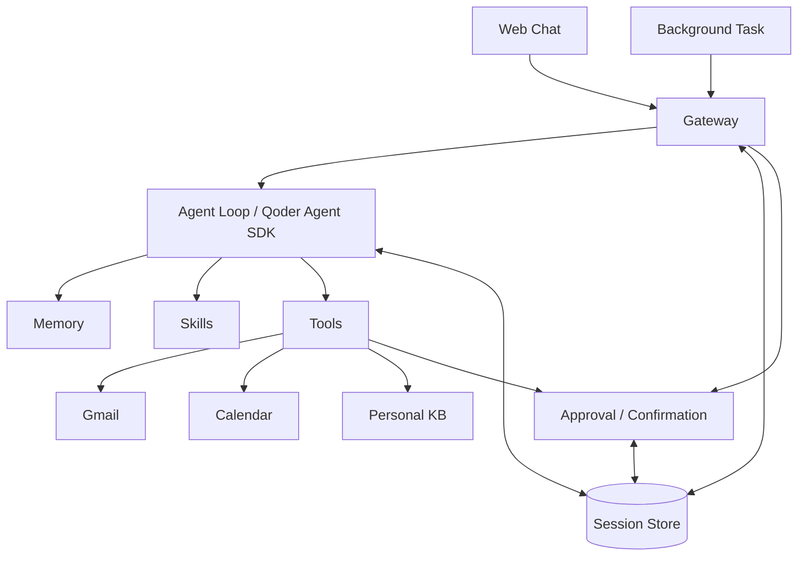

# Pebble v1 设计

本文承接 `v1-spec.md`：规格定义做什么和验收标准，本文定义组件划分、执行约束的实现方式、代码结构、交付顺序与验证证据。两者冲突时以规格为准。

第 1–6 节是设计，改动需要说明理由；第 7 节的阶段状态随实施推进更新；第 8–9 节是工作约定，第 10 节记录当前实现。

## 1. 整体结构

采用 Python、Qoder Agent SDK、SQLite 和支持 PC、手机浏览器的响应式 Web。Python 服务常驻运行，由 SDK 管理本机 qodercli 子进程；整体部署为单实例。模型自主组合工具完成目标，程序保证确认、持久化与去重约束。



图中 Tools 下方表示工具实现；外部写入必须经过 Confirmation。Idempotency 由工具执行与存储中的唯一约束和状态检查共同实现。

参考 Hermes 的入口、Agent、工具和会话存储划分。Qoder Agent SDK 承担 Agent 循环与会话接入，Pebble 实现产品交互及执行约束。[Hermes 架构](https://hermes-agent.nousresearch.com/docs/developer-guide/architecture/)、[Qoder Agent SDK](https://docs.qoder.com/cli/sdk/overview)。

## 2. 组件与代码结构

| 组件 | 职责 | 位置 |
| --- | --- | --- |
| Web Chat | PC 与手机共用响应式界面，提供对话、进度、来源查看、草稿编辑、明确确认，以及规则和 Skill 审阅 | `web/`（TypeScript + React + Vite） |
| Gateway | HTTP、SSE、认证；接收用户与后台输入，定位会话，启动 Agent 并返回结果 | `server/api/`（HTTP/SSE）、`server/gateway/`（后台运行） |
| Agent Loop | 通过 Qoder Agent SDK 调用模型和工具，加载 Memory 与已生效 Skills，按目标决定下一步 | `server/agent/` |
| Memory | 保存用户偏好、纠正及持久规则，供后续会话使用 | `server/memory/` |
| Skills | 保存可复用流程，管理草稿、审核、生效版本及 Git 历史 | `server/skills/` |
| Tools | 集中注册、校验和调用工具；每个实现负责自己的认证、协议和业务校验 | `server/tools/` |
| Session Store | 保存会话关联、任务目标和运行状态、待确认内容及版本、确认记录和逐项执行结果 | `server/sessions/`、`server/approval/` |
| Background Task | 定时检查新邮件并交给 Gateway 触发 Agent | `server/tools/gmail/sync.py` |

PC 与手机共用 `web/` 中的页面组件和交互逻辑，按屏幕尺寸调整布局；两端提供规格要求的完整功能，使用同一套 API、任务状态和确认流程。此处明确双端交付范围，避免仅以手机界面作为实现和验收目标。

Session Store 是 Gateway、Agent Loop 与 Confirmation 的共享持久化入口。业务状态使用 SQLite，资料原件、规则和 Skill 使用文件保存，不要求所有数据都进入会话记录。

代码结构：`#` 后是该条目的职责，目录注释对应上表组件。

```text
Pebble/
├── web/                      # Web Chat：TypeScript + React + Vite
├── server/                   # Gateway + Agent Loop + Tools + Session Store
│   ├── main.py               # 服务启动、SDK 配置与工具注册
│   ├── config.py             # 模型、持久目录与外部服务凭证引用
│   ├── db.py                 # SQLite 连接、约束与迁移
│   ├── pyproject.toml
│   ├── api/                  # HTTP/SSE 传输层
│   │   ├── routes.py         # 请求结构、服务依赖与路由：健康检查、任务、对话、确认
│   │   └── errors.py         # 业务异常到 HTTP 响应的映射
│   ├── gateway/              # 应用后台运行，不依赖 HTTP 请求生命周期
│   │   ├── runtime.py        # 输入登记、调用调度、事件订阅、恢复、结果交回与邮件来源插孔
│   │   └── agent_contract.py # Agent 调用接口与事件类型
│   ├── errors.py             # 跨模块共享的业务异常
│   ├── agent/                # 不实现自有循环，只装配 SDK
│   │   ├── client.py         # SDK 客户端装配、消息流转与会话读取
│   │   ├── mcp.py            # 应用进程内的工具端点：按轮次登记模型可见工具
│   │   ├── toolset.py        # 按装配依赖绑定业务工具，按轮次筛选模型可见范围
│   │   ├── context.py        # 每轮系统提示与技能名单组装
│   │   └── prompt.py         # 面向个人助理的系统提示
│   ├── tools/                # 统一注册 + 按服务分目录实现
│   │   ├── registry.py       # 工具定义、副作用声明与统一注册
│   │   ├── gmail/
│   │   │   ├── tools.py      # 给模型的查询与草稿工具
│   │   │   ├── service.py    # 邮件草稿的业务校验、存储与版本管理
│   │   │   ├── sender.py     # 确认后发送与结果核实，只由 Confirmation 调用
│   │   │   ├── client.py     # Gmail 协议与认证
│   │   │   └── sync.py       # Gmail 增量检测与游标
│   │   ├── calendar/
│   │   │   ├── tools.py      # 查询、冲突检查、准备创建
│   │   │   └── client.py     # iCloud 协议与认证
│   │   └── personal_kb/
│   │       ├── tools.py      # 保存、检索、引用与归档
│   │       └── service.py    # 索引与文件存储
│   ├── sessions/             # Session Store
│   │   ├── service.py        # 会话关联、运行状态、预览与逐项结果
│   │   ├── repository.py     # 任务与操作 SQL
│   │   └── runs.py           # 后台调用记录 SQL
│   ├── approval/             # Confirmation
│   │   ├── service.py        # 确认执行：版本校验、取得执行权、发送与结果保存
│   │   └── repository.py     # 确认记录与执行结果 SQL
│   ├── memory/               # Memory
│   │   └── service.py        # 持久规则的文件存取与 Git 历史
│   ├── skills/               # Skills
│   │   ├── service.py        # 草稿、审核与版本管理（文件 + Git）
│   │   └── loader.py         # 向 SDK 同步生效 Skill
│   └── models/
│       ├── session.py        # 任务与 SDK 会话 ID 关联、目标与运行状态
│       └── approval.py       # 待确认内容、版本、确认记录与执行结果
├── tests/                    # 共享 fixture 位于根目录
│   ├── api/                  # 健康检查、真实 HTTP/SSE 与进程重启
│   ├── gateway/              # 后台调用、事件与结果回传
│   ├── storage/              # SQLite、任务草稿与确认执行
│   └── support/              # Agent 替身和可启动测试后端
└── docs/
    ├── v1-spec.md
    └── v1-design.md
```

这是起始结构，按实际代码规模合并或拆分文件。每个源码目录控制在 4–5 个文件以内（含 `__init__.py`），按职责组织，不为凑数增加转发层。当前 HTTP 路由集中在 `api/routes.py`；后台调用与事件订阅归属 `gateway/`，使后台入口无需依赖 HTTP 模块。Idempotency 不设独立子系统，由 `approval/`、`sessions/` 和具体工具的唯一约束与状态检查共同实现；Git 版本操作由 `memory/`、`skills/` 内的小函数承担。

直接接入 Qoder Agent SDK 带来的取舍：

- Agent 循环、消息流和模型会话历史由 SDK 与 qodercli 承担；`agent/` 只做客户端装配、上下文和系统提示，不实现自有 loop/runtime。
- `models/` 不含消息与规则：模型历史复用 Qoder CLI 的本地会话存储，SQLite 只保存任务与 SDK 会话 ID 的关联及确认、执行状态；Memory 规则与 Skill 内容以文件保存并经 Git 管理。
- Skill 内容放在实例数据目录而非代码包内，不内置业务流程。
- 外部写工具只向模型暴露准备方法，执行函数由 `approval/service.py` 直接调用，详见第 3 节。

Memory 保存“用户的偏好和规则”；Personal KB 保存“资料及原文证据”。Personal KB 是可由 Agent 调用的工具，在实例本地实现。

恢复会话时明确指定 `resume`。[会话管理](https://docs.qoder.com/cli/sdk/session-control)

## 3. 工具接入

Gmail、Calendar、Personal KB 都通过相同入口注册，没有专属于某种服务的核心调度分支。

每个工具提供名称、能力说明、参数结构、调用实现及副作用类型。副作用由程序声明，区分只读、本地写入和外部写入，不能由模型更改。

- 只读工具校验参数后直接调用。
- 本地写工具遵守自身规则，例如只允许生成 Skill 草稿，不能代替用户批准 Skill。
- 外部写工具向模型注册准备预览和读取已确认内容的方法，原始写入方法不暴露给模型；执行函数由 Confirmation 调用。首版使用 Python 函数和静态注册，由应用进程自己的 MCP 端点按轮次暴露：每轮登记一个一次性路径，模型只看到当轮允许的工具，不另建常驻 MCP 服务。[工具接入](https://docs.qoder.com/cli/sdk/tools)

预览展示完整关键内容、目标和实际影响，提供必要的编辑字段。编辑后由工具重新校验、保存新版本。服务认证、邮件线程、日历冲突等逻辑留在具体工具中。

新增工具只需增加实现并注册，按需要补充编辑界面和后台触发代码，沿用现有 Agent 与确认流程。

首批工具的职责：

| 工具 | 首版能力与关键约束 |
| --- | --- |
| Gmail | 搜索邮件，读取单封、完整往来及附件，准备回复或主动新邮件，确认后发送并核实结果；草稿保存在本地 |
| Calendar | 查询 iCloud 日程、检查冲突、准备预览、确认后创建；正确处理时区和已有重复/全天日程；执行前检查目标时间 |
| Personal KB | 保存、索引、检索和更新资料，归档任务来源及结果；引用带资料版本和原文位置，更新后旧引用仍可定位 |

## 4. 运行机制

### Session Store

任务开始、等待用户、准备操作和取得执行结果时保存必要状态。页面刷新后读取已保存内容；SSE 断开不取消后台执行。

每个任务关联自己的会话。同一会话的 Agent 调用串行进行，避免上下文互相覆盖。Agent 一轮结束不等于任务成功，界面依据实际工具结果展示各项进度。

### Approval / Confirmation

所有具有副作用的外部写操作遵循：

```text
准备内容 → 保存预览 → 用户编辑/审阅 → 明确确认最终版本 → 执行 → 保存结果
```

确认记录绑定操作标识和最终内容版本，身份来自已登录用户。执行直接读取已确认内容，不让模型重新生成参数。修改使旧确认失效；已经执行中的内容不能原地修改。

程序通过数据库原子状态更新取得执行权，随后在事务外调用工具。重复确认返回已有状态，不能重复调用。确认和执行不依赖浏览器连接保持打开。SDK 工具权限不代替业务确认；等待用户时返回已保存的待确认状态，不让权限回调一直等待浏览器端响应。执行结果保存后作为输入交回对应 Agent 会话。

邮件的确认执行在 `approval/` 中实现，新邮件与回复共用 `approval_executions`（schema 2 建立，schema 3 增加发送开始时间）：操作标识为主键，记录首次成功确认的任务（结果回传目标）、确认版本、确认时间及结果字段；操作状态仍用 `operations.status`，不复制一套状态。一次确认按以下顺序处理：

1. 写事务内检查任务与操作存在、确认版本等于当前版本；已有执行记录时直接返回已有状态，不再次发送。
2. 首次确认要求操作处于 `pending`：同一事务写入确认记录并将状态置为 `sending`，随后返回已接受状态。
3. 后台在写事务内标记发送开始并读取确认版本；提交后调用发送函数。重复调度不能再次取得执行权，确认输入不含正文。
4. 新事务保存实际结果并更新状态：明确成功记 `sent` 与邮件 ID；明确失败记 `failed` 与原因；超时、异常或返回不符契约记 `unknown`，不推断未发送，不自动重试。
5. 结果保存失败时向调用方报错，已有执行记录仍阻止重发；进程中断遗留的 `sending` 在服务启动时由 `recover_interrupted_executions()` 置为 `unknown`，该恢复不放进 `init_db`，避免普通初始化影响正在执行的调用。

回传任务取首次成功确认的任务，不读取操作创建任务，也不改动各任务的会话关联。首版按单实例实现，不增加多实例执行接管、通用重试，也不开放任意修改操作状态的接口。

日程创建与邮件发送分别确认、分别记录结果。发现相关内容已变化、字段不明确或时间冲突时，重新澄清和准备预览；不自动修改已确认内容。

### Background Task

后台机制负责定时检查新邮件，并把未处理邮件交给 Gateway 自动启动 Agent。Gmail 同步游标及邮件协议处理属于 Gmail 工具实现，后台调度只负责触发。

等待用户补充或确认时，保存问题、草稿和状态，结束当前 Agent 运行。用户回应或执行结果到达后继续相应任务；等待中的任务不阻塞其他任务。

首版用常驻进程内的定时与调度代码实现，不引入独立任务系统或任意模型调用的断点恢复。

### Idempotency

通用层通过操作标识、数据库唯一约束和原子状态检查，防止同一操作重复执行。具体工具负责自身业务身份：例如 Gmail 按邮件 ID 去重，并将同一来信的同一回复关联到已有操作，防止模型重新准备时重复发送。

外部结果分为成功、明确失败和待核实。发送超时或进程中断留下的未决发送不能当作未发送，须先通过 Gmail 查询实际结果；查不到一次不等于未发送。未核实前不能再次发送，不采用通用自动写重试。

## 5. Memory、Skills 与资料

用户纠正可以由模型或用户主动沉淀为可读、可编辑的 Memory，由 Pebble 保存并在每轮上下文装配时加载当前规则。规则不能覆盖代码中的外部写确认约束。

Skills 同样支持模型自主提出和用户主动要求。自主生成的 Skill 先保存为草稿，在对话中提示审阅，展示触发条件、参数、流程、工具、副作用及确认要求。批准绑定最终版本；修改后不能沿用旧批准。加载器只提供已批准版本，未批准草稿仅用于审阅，不能作为执行指导；草稿存放于 SDK Skill 发现目录之外。通过 SDK 的 `skills` 配置限定已生效 Skill，恢复会话时同步当前批准版本。[Skills 接入](https://docs.qoder.com/cli/sdk/skills)

Skill 审核由 Skills 管理；批准某个 Skill 不替代其运行时每次具体外部写操作的确认。规则、Skill 与非敏感配置通过 Git 管理，可查看变化和回退。

Personal KB 保存原件与可定位的检索片段。任务结束后，Agent 通过 KB 工具归档关键来源及逐项结果，并区分原始证据和模型总结。

## 6. 技术与部署

Gateway 以 HTTP 提交操作、SSE 展示进度。Agent Loop 使用 `qodercn-agent-sdk` 的 `QoderSDKClient` 管理多轮会话并消费消息流；运行时使用 SDK 配套的本机 CLI。[SDK 概览](https://docs.qoder.com/cli/sdk/overview)

模型先采用一个明确配置的模型完成闭环。Qoder 托管模型从 `get_available_models()` 获取；使用自有 API Key 时通过 `resolve_model` 返回 `CustomModel`。BYOK 三项（供应商、密钥、型号）在装配期校验完整性，缺项直接报错，不静默退回托管模型；供应商标识经 `agent/client.py` 的登记表映射协议风格，未登记同样报错，登记表的增补以 `list_byok_providers()` 目录为准。不增加动态路由模块。[Python SDK 参考](https://docs.qoder.com/cli/sdk/references-python)

SDK 显式限定项目工具和必要的 Skill 能力，使用独立工作目录与配置目录，限制配置加载来源，禁用可绕过确认或 Skill 审核的通用 Shell、任意文件写入及无关扩展；使用面向个人助理的系统提示。工具授权不使用权限绕过模式。[权限控制](https://docs.qoder.com/cli/sdk/permissions)

模型与外部服务凭证仅保存在服务端，不进入聊天上下文、前端或 Git。Web 访问采用 HTTPS 和单用户认证，确认请求校验用户身份与来源。

SQLite、会话和资料文件使用实例持久目录。日志关联会话和操作，保留实际结果，避免记录凭证。

## 7. 交付阶段

按 `v1-spec.md` 第 5 节的验收场景逐步交付完整链路。本节状态随实施更新；阶段 2 进行中：Web、Gateway、Qoder CN SDK 与 Gmail 生产装配已接通，自动化测试使用外部边界替身，真实账号验收尚未完成。

| 阶段 | 交付物 | 通过条件 |
| --- | --- | --- |
| 1. 验证依赖 | Qoder Python SDK 与配套 CLI、Gmail、iCloud、资料解析的最小验证程序 | 目标模型可调用自定义工具、会话按 ID 恢复；工具与 Skill 加载边界有效；真实接口可用；资料能定位原文；SDK 与 qodercli 版本锁定 |
| 2. 邮件完整链 | Web → Gateway → Agent → Gmail → 预览编辑 → 确认发送 → 结果 | PC 与手机均可完成；刷新保留草稿；旧确认、重复确认及重复准备不能重复发送 |
| 3. 跨工具任务 | Memory、Calendar、Personal KB 接入 | 活动邀请能组合工具、追问、分别确认、准确报告部分结果并归档来源 |
| 4. 后台运行 | Background Task 持续检查 Gmail | 关闭 Web 仍自动处理新邮件；重复检查不重复处理；等待用户不阻塞其他任务 |
| 5. 能力成长 | Memory 编辑、Skills 草稿/审核、Git 历史 | 纠正在新会话生效；自主与用户触发均可沉淀；草稿不执行；审核最终版本后才能生效 |
| 6. 部署验收 | 常驻服务、配置样例、部署说明和验收记录 | 分别在 PC 和真实手机浏览器上，结合真实 Gmail、iCloud 完成规格中的全部场景 |

第一阶段验证 SDK 认证及目标模型配置（托管模型或 BYOK）、进程内 MCP 工具、消息流转 SSE、会话持久目录与恢复；确认待审批返回后能结束当前轮，用户确认执行后可将结果交回原会话。同时依据真实材料确定资料格式、检索实现、依赖版本、初次邮件处理起点和 PC、手机的 Web 访问方式。真实写入测试使用明确指定的收件人、日历及内容，取得授权后执行；模拟验证不算真实集成通过。

第三阶段用一个仅用于测试的新工具验证扩展：增加实现并注册后，沿用原有 Agent 和确认路径。该测试不增加首版产品功能。

活动邀请仅作为验收场景，执行步骤由模型判断，不固化为业务流水线。完整链路为：Background Task 检查并去重 Gmail 后交给 Gateway；Gateway 定位会话，Agent 加载 Memory 和已生效 Skills；Agent 调用邮件、日历和 KB 工具，缺信息或冲突时保存问题并追问；写操作进入 Confirmation，预览和版本保存到 Session Store，关闭页面仍可继续编辑；用户分别确认后程序校验版本和执行状态、调用工具并保存逐项结果；Agent 据实回复并归档来源及结果，部分失败不报告整体成功。

## 8. 每项工作的闭环

1. 对照规格明确输入、结果及验收条件。
2. 只确定当前实现需要的参数、状态和存储约束。
3. 完成包含必要 Web 交互和持久化的最小链路。
4. 验证实际工具参数、调用次数和保存结果，再检查页面表现。
5. 审查差异、更新必要说明并记录验证证据。

git 提交遵循 `AGENTS.md` 的约定：当前分支、英文 `[Module] Description`、不加 co-authored-by。

## 9. 验证要求

每次变更执行相关检查：Python 后端做静态检查和 pytest，Web 做类型检查、构建和相关测试；修改模型、提示或工具说明时回归相关行为样例。业务约束使用确定性测试，持久化使用真实 SQLite，界面使用 PC 与手机视口端到端测试，外部协议使用真实账号验证。模型行为评测检查工具轨迹、追问及结果准确性，不要求固定措辞或固定调用顺序。验收记录区分已通过、模拟通过和待验证，不能用一次模型成功代替全部验收。

| 检查场景 | 规格依据 | 设计保证 | 验证方式 | 阶段 |
| --- | --- | --- | --- | --- |
| PC 与手机布局及完整交互 | §3.2、§6.1 | 响应式页面共用 API、任务状态和确认流程 | 两种视口分别验证任务发起、进度、来源、草稿编辑、确认及资料、规则与 Skill 操作 | 2、3、5、6 |
| 页面关闭、刷新、等待用户 | §6.1 | 待确认内容持久保存，等待时结束当前 Agent 运行，SSE 断开不取消执行 | 真实 SQLite + PC 与手机视口端到端 | 2、4 |
| 修改后旧确认、同时重复确认、编辑与执行竞争 | §6.2、§6.3 | 版本绑定与原子状态更新取得执行权，执行中内容不能原地修改 | 确定性测试断言外部调用次数与参数 | 2 |
| 重复同步、重复准备回复 | §6.3 | Gmail 处理记录与已有回复关联，阻止重复处理/发送 | 确定性测试 + 真实 Gmail 核实 | 2、4 |
| 发送结果未知 | §6.3 | 保持待核实，先查实际结果 | 确定性测试 + 真实接口 | 2 |
| 缺信息、时间冲突、部分成功 | §6.2 | 重新澄清与准备预览，逐项如实报告结果 | 模型行为评测检查工具轨迹与结果准确性 | 3 |
| 来源定位与结果归档 | §6.1 | 引用带资料版本和原文位置 | 真实材料检索验证 | 3 |
| 规则与已批准 Skill 跨会话生效 | §6.4 | 每轮装配当前规则，加载器只提供已批准版本 | 新会话回归样例 | 3、5 |
| Skill 草稿未审核、审核后修改 | §6.4 | 草稿存于发现目录之外，批准绑定最终版本；Skill 批准不代替外部写确认 | loader 边界测试 + 审阅流程端到端 | 5 |
| 邮件或资料中的指令 | §3.3 | 不能代替用户授权，外部写必须经确认 | 注入样例评测 + 调用次数断言 | 3、5 |
| 新增工具 | 可维护性 | 注册后沿用统一调用、确认与结果保存路径 | 测试专用工具走完整链路 | 3 |

以上追溯关系为本设计层面的核对，通过与否以第 7 节阶段验收记录为准。

## 10. 当前实现

### Gateway 当前实现

新邮件由检测程序交给 `gateway/runtime.py` 的内部入口，邮件去重关联保存在
`mail_task_links`，由该模块自己读写。创建任务、邮件关联及首轮调用在同一写事务完成。
新邮件输入只携带邮件标识，摘要、建议及后续工具选择由 Agent 决定，不固化为邮件处理流水线。

`gateway/runtime.py` 使用 FastAPI lifespan 所在事件循环管理异步任务，保留任务引用；每个任务
按 `agent_runs` 的插入顺序启动就绪输入，不同任务独立执行。尚无会话的结果回传等待会话建立。
HTTP/SSE 断开不取消工作。同步发送通过 `asyncio.to_thread`，正常关闭等待发送落盘，
取消仍在运行的 Agent 调用；下次启动将运行中调用记为 interrupted，不自动重放。
待处理输入继续运行；已有确认但进程遗留未完成的发送不自动重发：已经调用过发送函数的记
unknown 等待核实，`started_at` 仍为空即从未进入执行阶段，是明确未发送，记 failed。

schema 3 增加 `agent_runs`、`mail_task_links` 及确认记录的 `started_at`。schema 4 将回复专用草稿表收敛为新邮件与回复共用的 `mail_drafts` 和 `mail_draft_versions`。
接受确认与后台开始发送分别原子处理，发送开始标记防止重复调用；保存发送结果和登记一次
回传共用事务。Confirmation 依赖 sessions 的调用记录存取，不依赖 SDK 或 api 实现。
Agent 历史由 SDK 的 read_history 返回；Gateway 不保存另一份模型对话历史。

新邮件来源是装配插孔：`gateway/runtime.py` 的 `MailSource` 只有 `start` / `stop` 与 `error`，
由 `create_app(mail_source=...)` 传入，应用在恢复中断调用之后启动、关闭前停止。检测逻辑不在
其中，真实 Gmail 检测（`tools/gmail/sync.py`）实现同一接口，由生产工厂装配。

### Agent 装配当前实现

`agent/client.py` 的 `QoderGateway` 实现 `AgentGateway` 接口：每轮输入独立启动一次 qodercli 子进程，
新会话由 CLI 生成会话标识并经 init 事件交回，Gateway 绑定到任务后，后续轮次用 `resume` 接续，
本层不保存会话状态。`read_history` 直接读 CLI 落在 `data_dir/agent/config` 下的会话记录，只保留
双方文本块，思考与工具调用不进入历史。子进程以 `data_dir/agent/workspace` 为工作目录。

模型可见的工具由本进程的 MCP 端点提供（`agent/mcp.py`，server 名 `pebble`）：每轮登记一个一次性
路径，绑定当轮工具集合、任务标识与草稿事件队列，CLI 子进程按回环地址
`http://127.0.0.1:{settings.port}/mcp/{token}` 连接，轮次结束即撤销，旧路径不再指向任何工具。端点
由 `create_app(tool_server=...)` 挂在业务路由之外，端口与 uvicorn 监听同一设置。工具候选来自
`agent/toolset.py` 按副作用筛选的结果；内置工具与本机设置一律关闭（`tools=[]`、`setting_sources=[]`、
`strict_mcp_config`），技能名单由 `agent/context.py` 逐轮组装（当前为空，接入已批准名单后扩展）。
系统提示同样由 `context.py` 组装：基础提示固定在最前，本轮材料（触发载荷、执行结果等）以
带标题的块追加在末尾，结构化数据渲染为 JSON 块、自由文本按原文呈现，不伪造用户消息，
历史接口因此只含双方真实说过的内容。基础提示只写域中立的工作原则，领域行为语义
（草稿待审阅、发送边界等）由各工具的 description 携带。网关契约收敛为 `stream_turn` 与
`read_history`：触发轮的消息与材料由触发域组装（邮件见 `tools/gmail/trigger.py`），
执行结果回传的措辞由 `gateway/runtime.py` 持有，网关本身不区分触发来源。

事件收敛规则：`include_partial_messages` 打开后按增量转发 text，整段消息仅在无增量时补发；
工具成功后入队的 draft_saved 在该工具调用之后的模型下一条消息之前送出，草稿到达先于模型叙述；
ResultMessage 收敛为 done 或 error，结束事件之后不得再有事件，流自然结束而未给出结束事件时
补发 error。会话建立事件一轮只广播一次，同一标识重复上报不重复转发。模型与凭证只在这一层读取：
托管模型直接给型号名；配置第三方提供方时三项必须齐全且供应商已登记，
写错在装配期报错，不静默退回托管模型，随后转成 BYOK 的 `resolve_model` 回调；缺令牌时调用前抛
DependencyUnavailableError。

### 工具装配当前实现

新邮件与回复草稿共用同一业务校验和 `MailDraftStore`，不设注入接口；测试需要控制校验
时机或结果时替换模块属性。工具实现把 Gmail 客户端、草稿存储和任务存储声明为仅关键字参数，
参数名与 `agent/toolset.py` 的 `ToolDeps` 字段一致，装配期按名字绑定，registry 不把仅关键字
参数放进模型可见的 schema。进程内没有工具依赖的全局单例：
`create_app` 接收已构造的存储，工具与 HTTP 共用同一实例，同一进程可并存互不影响的装配。
Gmail 客户端是必需的装配参数，测试显式注入替身。

工具清单与模型可见范围都由注册时的副作用声明决定，不是手写清单：`agent/toolset.py` 遍历注册表
绑定依赖，声明了无法装配的依赖在装配期就失败；筛选只有 `agent/toolset.py` 的 `exposed_tools` 一处，
EXTERNAL_WRITE 不在任何一轮的允许集合内，新邮件轮只允许 READONLY。草稿业务校验只在 `MailDraftStore` 内做一次；回复草稿在按原邮件去重
之后，符合契约 §4 复用已有操作时候选内容不参与校验。工具端点（`agent/mcp.py`）把已实现的契约错误按
`server/errors.py` 的名称与字段交回模型，与 HTTP 响应体同一套词汇；调用不在当轮清单里的工具按
不存在处理，不解释原因。

发送结果为 unknown 时由 `Confirmation.verify_pending` 用 Gmail 的 `verify_message` 只读核实：输入是
已确认版本的内容证据和用于重建确定 Message-ID 的操作标识，不重发。查不到不等于未发送，所以核实只把 unknown
升级为 sent，不下明确失败的结论；升级后的结果按核实专用去重键另登记一次回传，原结果的回传
尚未结束时不再登记。核实由 `POST /operations/{operation_id}/verification` 显式发起，
读接口不做外部调用。

未接入 Agent、核实或发送依赖时，相关新工作在写入前拒绝。只读任务、草稿及执行查询仍可用。
生产默认装配不使用替身，测试替身只替换 SDK 子进程与 Gmail 投递这两个外部边界。认证部署不属于
本地后端验收的交付范围；当前服务仅按本机测试使用，正式 Web 接入仍须完成既定身份和来源检查。
