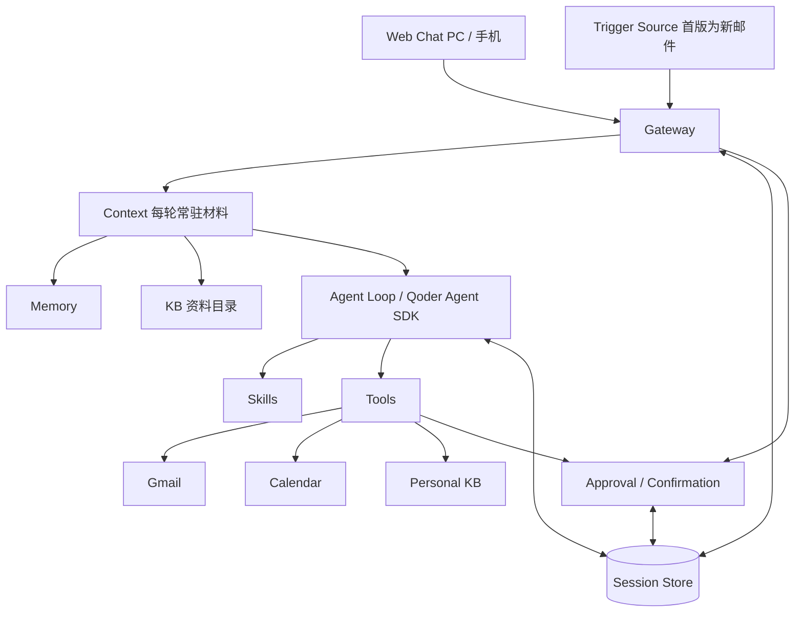

# Pebble v1 设计

本文定义组件划分、执行约束的实现方式、交付阶段与验证要求；做什么与验收标准见 `v1-spec.md`，冲突时以规格为准。各域字段见 `docs/contracts/`（`mail.md`、`calendar.md`、`personal-kb.md`、`memory.md`、`skills.md`），记忆与资料的产品行为见 `memory-spec.md`、`kb-spec.md`，实现状态见 `status.md`。

第 1–6 节是设计，改动需说明理由；第 7 节是交付阶段；第 8–9 节是工作约定；第 10 节是实现要点。

## 1. 整体结构

Python 常驻服务 + Qoder Agent SDK（管理本机 qodercli 子进程）+ SQLite + 响应式 Web，单实例，经 HTTPS 供已认证的单用户远程访问。

用户对话与触发源（首版为新邮件）汇入同一 Gateway，共用调度、时间线与确认流程。模型自主组合工具，程序保证外部写授权、持久化与去重。



个人上下文分四层（参考 OpenHuman）：Memory 与知识库只保存和检索信息，不执行操作、不决定下一步；Context 每轮装配容量受限的常驻材料（记忆全文与资料目录），其余不自动注入；Agent Loop 由 SDK 承担；Tools 访问外部服务与本地资料，外部写统一经 Confirmation。

入口、Agent、工具与会话存储的划分参考 [Hermes](https://hermes-agent.nousresearch.com/docs/developer-guide/architecture/)。

## 2. 组件与代码结构

| 组件 | 职责 | 位置 |
| --- | --- | --- |
| Web Chat | PC 与手机共用的响应式界面：Composer、有序时间线、草稿卡、资料与记忆页面 | `web/` |
| Gateway | HTTP/SSE 与认证；接收用户与触发源输入，定位会话，启动 Agent | `server/api/`、`server/gateway/` |
| Context | 每轮装配基础提示与常驻材料，控制容量；不预先检索 | `server/agent/context.py`、`client.py` |
| Agent Loop | 经 SDK 调用模型与工具，加载已生效 Skills | `server/agent/` |
| Memory | 长期记忆文件，每轮判断与后台回顾写入 | `server/memory/` |
| Skills | 两条来源、草稿审核、生效版本与 Git 历史 | `server/skills/` |
| Tools | 集中注册与调用；各实现负责自己的认证、协议与校验 | `server/tools/` |
| Session Store | 任务、会话关联、固定模型、运行状态、时间线、附件、待确认内容与版本、确认与执行结果 | `server/sessions/`、`attachments.py`、`server/approval/` |
| Trigger Source | 触发源插孔与 Gmail 增量检测 | `server/gateway/runtime.py`、`server/tools/gmail/sync.py` |

代码结构到目录一级，文件级职责见各模块开头的注释：

```text
Pebble/
├── web/                # Web Chat：TypeScript + React + Vite
├── server/             # 根目录：启动、配置、SQLite 迁移、附件、共享业务异常
│   ├── api/            # HTTP/SSE 路由、错误映射、访问控制与前端托管
│   ├── gateway/        # 后台调度、事件订阅、恢复、结果交回、触发源插孔
│   ├── agent/          # 只装配 SDK：客户端、模型目录、工具端点、按轮次筛选工具、上下文
│   ├── storage/        # 数据目录共享设施：进程内锁、Git 忽略规则、按行锚点编辑
│   ├── tools/          # 统一注册 + gmail/、calendar/、personal_kb/、history/、memory/
│   ├── sessions/       # 任务、运行、时间线与历史检索
│   ├── approval/       # Confirmation
│   ├── memory/         # 记忆读写、静默的每轮判断、后台回顾与提示
│   └── skills/         # 阶段 5
├── tests/              # api/、agent/、gateway/、storage/、tools/、support/；acceptance/ 为真实模型验收
└── docs/
```

结构约定：

- 目录按职责组织，不为凑数增加转发层；HTTP 路由集中在 `api/routes.py`，后台调度归 `gateway/`，触发源不依赖 HTTP 模块。
- `agent/` 不实现自有 Agent 循环。模型历史用 Qoder CLI 的会话存储（恢复时显式指定 `resume`）；SQLite 另存网页唯一读取的时间线与业务状态，两份数据互不解析。
- Memory、Skill 与资料放在实例数据目录，不内置业务流程。Skill 与资料由数据目录内独立的本地 Git 仓库管理，写入即提交、不推送；Memory 不做版本管理。
- 幂等不设独立子系统，由 `approval/`、`sessions/` 与各工具的唯一约束和状态检查共同实现。

## 3. 工具接入

所有域都通过同一注册入口，调度中没有专属某个服务的分支。每个工具声明名称、说明、参数与副作用；副作用由程序声明，模型不能更改：

- 只读：校验参数后直接调用。
- 本地写：遵守本域规则，例如只能产出 Skill 草稿、不能批准；只写资料文件。
- 直接外部写：在用户亲自发起的轮次由工具自己保存内容、取得执行权、调用外部服务并保存结果。日程创建属于此类。
- 永不暴露的外部写：只注册准备与读取草稿的方法，执行函数由 Confirmation 在用户确认后调用。邮件发送属于此类。

工具由应用进程自己的 MCP 端点按轮次暴露（每轮一个一次性路径）。注册表有三个：前台对话、后台记忆回顾与每轮记忆判断；后两个都只暴露 `memory_edit`，只在各自的一次性会话中出现。

新增工具只需实现并注册，按需补编辑界面与触发代码，沿用现有 Agent 与确认流程，并补一份域契约。待确认内容展示完整关键内容、目标与实际影响；编辑后由工具重新校验并保存新版本。

### 轮次可见范围

全部域共用这一张表（代码为 `agent/toolset.py` 的 `ALLOWED_EFFECTS`），各域契约只声明自己工具的副作用：

| 副作用 | 例子 | 新邮件触发轮 | 用户对话轮 | 执行结果回传轮 |
| --- | --- | --- | --- | --- |
| `READONLY` | 查询、检索、读取 | ✓ | ✓ | ✓ |
| `LOCAL_WRITE_ALL_TURNS` | 资料新建与修改 | ✓ | ✓ | ✓ |
| `LOCAL_WRITE` | 邮件草稿、资料归档、Skill 草稿 | — | ✓ | ✓ |
| `LOCAL_WRITE_USER_TURN` | 资料删除、移动、恢复 | — | ✓ | — |
| `DIRECT_EXTERNAL_WRITE` | 日程创建 | — | ✓ | — |
| `EXTERNAL_WRITE` | 邮件发送 | — | — | — |

SDK 内置工具同样只在用户对话轮开放：联网查询（`WebSearch`、`WebFetch`），以及任务有附件时的 `Read`。

理由：触发轮与回传轮的输入来自系统而非用户，拿不到外部写与联网查询，外部内容中的指令因此无法驱动外部写入或让数据离开实例；触发轮唯一的本地写是资料新建与修改，有提示、有版本、可恢复。定向修改某张草稿的轮次另外绑定该 `operation_id`，不能新建操作或读写其他草稿。

### 错误词汇

业务错误统一定义在 `server/errors.py`，HTTP 响应与交回模型的工具错误共用名称与字段。通用错误：

| 名称 | HTTP | 附加字段 | 含义 |
| --- | --- | --- | --- |
| `not_found` | 404 | — | 对象不存在；不属于当前任务的对象同样按不存在处理 |
| `version_conflict` | 409 | `current_version` | 基于的版本已不是当前版本，不写入 |
| `not_editable` | 409 | `status` | 当前状态不允许修改 |
| `unavailable` | 503 | — | 所需依赖未装配或不可用 |

校验失败统一为 422，附 `errors[]`（`field`、`message`），不保存数据；存储或索引不可用统一为 503。各域的具体名称见对应契约；任务与对话接口另有 `task_active`、`task_id_conflict`、`retry_unavailable`、`session_conflict`（409）与 `invalid_model`、`invalid_attachment`、`invalid_history`（422）。调用当轮不可见的工具按不存在处理。

## 4. 运行机制

### Session Store

- 任务在开始、等待用户、准备操作与取得结果时保存状态；等待用户时结束当前运行，回应或结果到达后继续，等待中的任务不阻塞其他任务。
- 每个任务关联自己的 SDK 会话，同一会话的调用串行。任务创建时固定模型，主回答、恢复轮、记忆判断与回顾都用它；标题、资料说明与图片说明用轻量模型（第 6 节）。
- 时间线按顺序保存：连续文字合并为一项，草稿工具成功时在当前位置插入卡片。卡片只存 `operation_id`，读取时物化最新版本与执行状态；卡片上的直接编辑与修改要求只新增版本，不移动卡片、不新增第二张；对话框里发出消息时，任务里待确认的草稿立即取消，Agent 再修改时另起一份新草稿并在当前位置插入新卡片。SSE 只传实时变化，断开不取消执行，结束后前端重读时间线对账。
- 附件整批校验，任一失败则整条消息不登记；按内部 ID 存在任务工作目录（`agent/workspaces/{task_id}/attachments/`）。图片同时作为 SDK 图片块传入，其他文件由 `Read` 读取，路径限制在该任务目录内。附件标为不可信输入；删除任务时一并删除。

### Approval / Confirmation

邮件与日程共用一套执行机制：保存不可变内容 → 写确认记录 → 原子取得执行权 → 在事务外调用外部服务 → 保存结果。区别只在授权来源：邮件来自用户对卡片上最终版本的确认，日程来自用户本轮的明确要求与齐全信息（规则见 `v1-spec.md` §3.3，冲突与覆盖参数见 `contracts/calendar.md` §2）。

- 确认绑定操作标识与内容版本，身份来自已登录用户；执行只读已确认内容，不让模型重新生成参数。修改使旧确认失效，执行中的内容不能修改。
- 执行权由数据库原子状态更新取得：重复确认返回已有状态，外部服务只调用一次。确认与执行不依赖浏览器连接；SDK 工具权限不代替业务授权。
- 结果分成功、明确失败、待核实：超时、异常或返回不符契约记待核实，不推断未执行、不自动重试，只能显式只读核实，核实只把待核实升级为成功。
- 进程中断遗留的执行中状态在启动时恢复：已进入执行的记待核实，未进入的记明确失败。这一步不放进 `init_db`。
- 用户确认后执行的结果登记一次回传轮，交回首次确认的任务；日程直接创建的结果已就地返回模型，不再回传；核实升级为成功时登记回传。
- 首版按单实例实现，不做多实例接管、通用重试或任意修改操作状态的接口。

### Trigger Source

触发源与用户对话共用调度入口，接口只有启动、停止与错误状态，检测逻辑与文案留在各域。首版为 Gmail 增量检测：定时查询收件箱新增邮件，成功交给 Gateway 后才推进游标，重复通知按邮件标识去重；游标失效时停止检测并在健康检查中说明，不跳过缺口。新增触发源只需在该域实现同一接口、提供触发轮的消息与材料，并在调度入口加一个分支。首版用进程内定时代码，不引入独立任务系统。

### 记忆判断与后台回顾

两者都是一次性 SDK 会话，MCP 端点只挂各自的记忆工具，不接续任务会话。判断静默运行；回顾按记录到的真实工具结果渲染整理提示（`memory/notices.py`），以 `notice` 写入时间线并经 SSE 推送，模型自述不作为依据。

- 判断：每个用户消息轮与主回答并行启动，输入为本条消息、近期对话与带锚点的当前记忆；歧义时不写入、不提问；无状态，不写 `agent_runs` 和任务时间线、不占运行槽，失败只记日志，不影响回答。
- 回顾：任务内每完成 5 个用户消息轮自动登记，登记时冻结对话窗口；在独立协程中、任务空闲时运行，不占运行槽，用户消息不等它。重启时进行中的回顾记为中断，下一条消息完成后重跑。手动入口 `POST /api/tasks/{id}/memory-review` 覆盖全任务历史，不受间隔与开关限制。

### 幂等

通用层靠操作标识、唯一约束与原子状态检查防止重复执行；各工具负责自身业务身份，例如 Gmail 按原邮件去重，同一来信的回复复用已有操作。

## 5. Memory、Skills 与个人知识库

三者都是实例数据目录里用户可直接读改的文件。Memory 与资料库格式见 `contracts/memory.md`、`contracts/personal-kb.md`；Skills 的后续规格见 `skill-spec.md`、`contracts/skill.md`，当前实现状态见 `status.md`。

- **Memory**：两个文件，每轮作为“关于你”“事实与约定”两块材料加载；不做版本管理（若数据目录仓库仍跟踪 `memory/`，启动时单独提交移出）。规则不能覆盖外部写授权，该约束由工具可见范围与 Confirmation 保证。
- **Skills**：用户自建即生效；Agent 从使用记录总结的草稿存放在 SDK 发现目录之外，在对话中提示审阅。批准绑定内容版本，内容再变化即停止加载、回到草稿。加载器只提供已批准且版本一致的内容，经本轮附加上下文与受限 skill_read 加载，恢复会话时重新校验版本。批准 Skill 不改变外部写的授权规则。
- **个人知识库**：Markdown 文件为准，派生的 FTS5 分节索引不进 Git，写入后增量替换，与 `kb/` 的 Git tree 不一致时整体重建；每次资料库操作前先把用户在文件系统中的改动提交为版本（移动按 `id` 识别并单独提交，历史跟随路径）。内部引用带路径、行号与 commit，只用于读原文；回答不展示来源，不记录出处。外部操作有结果后，Agent 可用 `kb_archive` 归档到 `kb/archive/`。资料管理界面经 `/api/kb/*` 直接调用 `KbStore`，与工具共用校验、版本与索引规则。

借鉴 OpenHuman（取舍见 `kb-spec.md` 第 10 节）：常驻与按需分开（记忆全文与上限 1500 字符的资料目录常驻）；资料累积后维护 `kb/topics/` 下的主题页，代替分层摘要树；不采用以数据库为准的存储、外部数据全量同步、数据块出处与会话前预检索。

## 6. 远程控制、安全与部署

HTTP 提交操作、SSE 推送进度；Agent 用 `qodercn-agent-sdk` 的 `QoderSDKClient` 与配套本机 CLI（[SDK 概览](https://docs.qoder.com/cli/sdk/overview)）。

### 远程访问

经 Tailscale 私有网络访问，部署步骤见 `README.md`：

- 服务只监听回环地址，由 Tailscale Serve 提供带正式证书的 HTTPS 地址并转发，不使用 Funnel，不暴露到公网；只有 tailnet 内的设备能连上。
- 单用户认证：身份取 Serve 注入的 `Tailscale-User-Login`（Serve 先清掉客户端自带的同名头），只接受配置名单内的账号。未认证请求不能读取任务、时间线、草稿、资料、Memory 与 Skill，也不能提交消息或确认；页面、接口、SSE 与附件下载经同一中间件校验。
- 来源校验：身份按设备认定，同一设备上的任何网页都会带着它，所以会修改数据的请求还要求 `Origin` 等于配置的对外地址。确认与执行的身份来自请求头而非请求体。
- 撤销与登出：在 Tailscale 移除设备、账号或让设备密钥过期，该设备立即无法连接；Pebble 不另设登录会话与令牌。
- 访问控制缺配置时拒绝启动；`PEBBLE_AUTH=off` 显式关闭，只用于本机开发。
- 页面由后端同源提供（`web/dist/`），对外只转发业务端口；Agent 工具端点单独监听另一个回环端口，不在转发范围内。
- 本机进程可以绕过 Serve 伪造身份头，不在防护范围内：它们本就能读实例数据目录。

### 模型与 SDK 约束

- 模型目录由 SDK 的 `get_available_models()` 读取，只含当前账号的托管与自定义型号，稳定 ID 取条目的 `value`（不用 CLI `--list-models`，它无法还原调用值）。读不到目录是暂时的，读到而型号不在其中才是确定不可用。
- 最近一次成功的目录缓存在 `agent/models.json`，启动时后台预读，读取失败不覆盖缓存。`GET /api/models` 有缓存即返回并按需后台刷新（`stale` 标记上次刷新失败）；新建任务时 24 小时内的缓存里有该型号即通过；已有任务每轮校验固定型号，读不到目录时放行，确定下线时该轮失败，不换模型。新邮件任务显式保存服务端默认模型。
- 主对话、恢复轮与记忆调用只用托管或账号自定义型号。一次性生成（任务标题、资料说明、图片说明）用轻量模型：配置 `PEBBLE_LIGHT_MODEL_*` 时经 `resolve_model` 走 BYOK，供应商、密钥、型号缺一或供应商未登记时在装配期报错，不静默退回托管模型；不配置时沿用 `PEBBLE_QODER_MODEL`。
- SDK 只开放项目工具与必要的内置工具，使用独立的工作目录与配置目录，不加载本机设置，禁用通用 Shell 与任意文件写入，不使用权限绕过模式（[权限控制](https://docs.qoder.com/cli/sdk/permissions)）。

### 凭证与数据

凭证只在服务端，不进入聊天上下文、前端或 Git；外部内容中的指令只是材料。实例数据目录保存 SQLite、SDK 会话与任务工作目录、Gmail 游标与凭证、`kb/`、索引、`memory/`、`skills/` 与 `skill_drafts/`。日志关联会话与操作，不记录凭证。

## 7. 交付阶段

按 `v1-spec.md` 第 5 节的两个场景逐步交付完整链路，进度见 `status.md`。

| 阶段 | 交付物 | 通过条件 |
| --- | --- | --- |
| 1. 验证依赖 | SDK 与 CLI、Gmail、iCloud、资料解析的最小验证 | 目标模型能调用自定义工具，会话按 ID 恢复；工具与 Skill 加载边界有效；真实接口可用；版本锁定 |
| 2. 对话与邮件 | Web → Gateway → Agent → Gmail → 编辑 → 确认发送 → 结果 | 纯对话不触发工具；两端可用；刷新保留草稿与顺序；旧确认、重复确认与重复准备不重复发送 |
| 3. 跨工具任务 | Memory、Calendar、Personal KB | 两个场景能组合工具、追问、按第 4 节授权、准确报告部分结果并归档 |
| 4. 触发源与后台运行 | Gmail 增量检测 | 关闭 Web 仍处理新邮件；不重复处理；等待用户不阻塞其他任务 |
| 5. 能力成长 | Memory 编辑、Skill 两条来源与审核、Git 历史 | 用户自建 Skill 即生效；至少一个总结草稿经审核生效；未审核草稿不执行；纠正在新会话生效 |
| 6. 远程控制与认证 | HTTPS、单用户认证、来源校验、部署说明 | 手机在外网完成两个场景；未认证请求被拒 |
| 7. 部署验收 | 常驻服务、配置样例、部署说明、验收记录 | 用真实 Gmail 与 iCloud 完成全部场景，按第 9 节区分结论 |

真实写入测试使用明确指定的收件人、日历与内容，取得授权后执行；模拟验证不算真实集成通过。第三阶段另用一个仅供测试的新工具验证扩展路径，不增加产品功能。

## 8. 每项工作的闭环

1. 对照规格与域契约明确输入、结果与验收条件。
2. 只确定当前实现需要的参数、状态与存储约束。
3. 完成包含必要 Web 交互与持久化的最小链路。
4. 验证实际工具参数、调用次数与保存结果，再检查页面。
5. 审查差异，更新文档，记录验证证据。

提交遵循 `AGENTS.md`。

## 9. 验证要求

- 每次变更：后端静态检查与 pytest，Web 类型检查、构建与相关测试；改模型、提示或工具说明时回归相关行为样例。
- 业务约束用确定性测试（断言外部调用次数、参数与保存结果），持久化用真实 SQLite，界面用 PC 与手机视口，外部协议用真实账号。
- 模型行为评测检查工具轨迹、追问与结果准确性，不要求固定措辞或调用顺序；注入样例检查外部内容不能驱动外部写。
- 验收记录区分已通过、模拟通过与待验证，不能用一次模型成功代替全部验收。

## 10. 实现要点

对照代码时需要知道、但模块注释里没有的约定；更细的机制见各模块注释。

### Gateway

- 新邮件交给 `gateway/runtime.py` 的内部入口，去重关联存在 `mail_task_links`；创建任务、关联与首轮调用在同一事务。新邮件输入只带邮件标识，后续由 Agent 决定。
- 调度在 FastAPI lifespan 的事件循环里运行，每个任务按 `agent_runs` 插入顺序处理。正常关闭先等发送落盘，再取消 Agent 调用；重启时运行中的调用记为 interrupted，不自动重放。
- `POST /api/tasks` 接受前端生成的 `task_id` 作为幂等键：重复提交返回已创建的任务（200）；该标识已被非用户任务占用时返回 409 `task_id_conflict`。
- `POST /api/tasks/{id}/retry` 只接受最后一条 interrupted、且期间没有产生操作记录的用户消息轮：恢复为 pending，复用原输入与附件，清掉未完成的助手文字；只由用户点击触发。
- 首个调用成功后，用一次无工具的轻量模型调用生成不超过 12 字的标题，失败时保留原目标。
- 表结构与迁移在 `server/db.py`，每个 schema 版本前的注释说明了当时的变化。
- 触发源插孔（`create_app(mail_source=...)`）在恢复中断调用之后启动、关闭前停止。
- 访问控制是纯 ASGI 中间件（`api/access.py`），不包装响应体，SSE 原样透传；`create_app(access=None)` 不装中间件，只供测试与本机开发。
- 工具端点随应用 lifespan 在 `PEBBLE_TOOL_PORT` 上单独监听，先于恢复与邮件检测就绪；内嵌服务不接管信号，也不重设日志。

### Agent 装配

- 每轮独立启动一次 qodercli 子进程，工作目录为该任务的 workspace；新会话标识经 init 事件交回并绑定到任务，之后用 `resume` 接续。
- 工具经本进程 MCP 端点（server 名 `pebble`）暴露；本机设置一律关闭（`setting_sources=[]`、`strict_mcp_config`）。技能名单逐轮组装，当前为空。
- 基础提示是域中立的助手定位，领域语义写在各工具的 description 里；本轮材料经 `SessionStart.additionalContext` 注入，不伪造用户消息。触发轮的消息与材料由触发域组装（邮件见 `tools/gmail/trigger.py`）。
- 运行时未启用自动压缩：恢复轮前读取上下文使用率，达到阈值时先完成 `/compact` 再提交输入。
- 事件：文字按增量转发；草稿事件在该工具调用之后、模型下一条消息之前送出；时间线项先持久化再发布带 `item_id` 的 SSE 事件，所以刷新前后位置一致；结束事件之后不再有事件，流意外结束时补发 error。
- 步骤说明：工具执行前按注册时声明的 `activity_renderer` 生成一句说明并附工具名；未声明说明的工具直接显示名称。`skill_read` 显示被调用的 Skill 标题，用户手动选择并注入的 Skill 在装载后显示名称。经 `activity` 事件转发；页面在本轮运行中汇总步骤，不写时间线，服务端只在内存保留最后一步供刷新读取；调用失败时附在错误说明末尾。

### 工具装配

- 工具清单与可见范围都来自注册声明，不是手写清单；无法装配的依赖在装配期失败。进程内没有工具依赖的全局单例，`create_app` 接收已构造的存储，工具与 HTTP 共用同一实例。
- 程序提示与步骤说明由各域在注册时声明（`notice_renderer`、`activity_renderer`），端点与网关不认具体工具名。
- 资料库的检索与写入共用数据目录锁，索引更新与 Git 提交串行。
- 日程创建工具在装配期绑定确认服务，未绑定时不注册。
- 生产装配为同步检测、模型工具、确认发送三个用途各建一个 Gmail 客户端。缺 Gmail 或 iCloud 配置时对应工具、检测与执行一并关闭，`/api/health` 的 `services` 显示 `unconfigured`，不计为故障。测试只替换 SDK 子进程、Gmail 投递与 iCloud CalDAV 三个外部边界。

### Web

- 路由：`/tasks`、`/tasks/:taskId`、`/search`、`/kb`、`/kb/doc`、`/kb/new`、`/memory`、`/skills`。断点 900px，以上为侧栏布局，以下为底部 tab；设计 token 见 `src/styles/tokens.css`。
- 新建任务不等服务端：前端生成任务标识后立即进入任务页（`src/pendingTasks.ts`）；失败时连接问题可原样重试（服务端按标识去重），输入被拒只能编辑后重发，消息不静默丢失。
- 任务列表每 5 秒轮询（页面不可见时暂停）；任务页用 SSE，有操作处于 `sending` 时每 1.5 秒轮询执行结果，重连后重读时间线。
- 草稿卡有未保存修改时不能确认，确认绑定卡片当前展示的版本；日程不渲染卡片；Skills 入口进入管理页。
